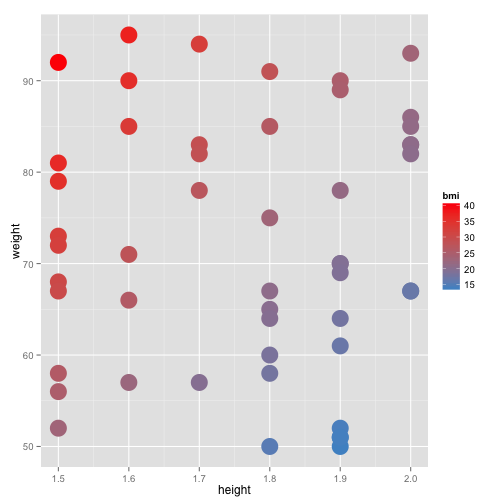
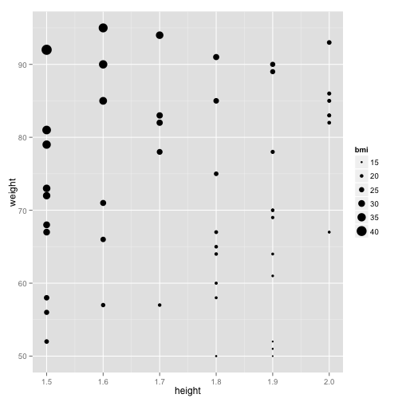
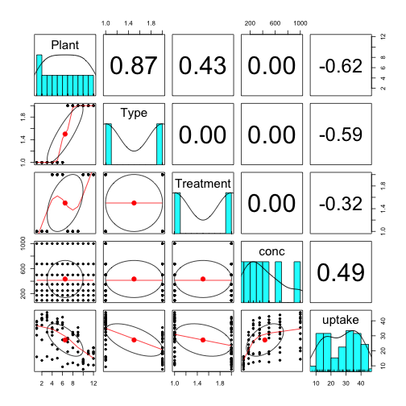

R Basics and RStudio
========================================================
author: Isaac Jenkins, BIO5 StatLab
date: February 6, 2014

Material borrowed largely from [Corey Chivers]
(https://sites.google.com/site/mcgillbgsa/workshops/intro-R-1), Thank You!


What is R?
========================================================

[R](http://www.r-project.org) is a **free software programming language** 
and software environment for 
statistical computing and graphics. The R language is widely used among 
statisticians and data miners for developing statistical software and data 
analysis.

*<p>Source: <a href="http://en.wikipedia.org/wiki/R_(programming_language)">
Wikipedia</a></p>*

Why use R?
========================================================

- It's FREE
- It works across platforms
- There are **5,169 CRAN Packages**
  - Something for everyone
  - See [CRAN Task Views](http://cran.r-project.org/web/views/)
- Provides a written record for **reproducibility**
- Did I mention it's **FREE**?

R's Popularity
========================================================

Ranks #15 among programming languages


*Source: [RedMonk People](http://redmonk.com/sogrady/2014/01/22/language-rankings-1-14/)*

Fun with R
========================================================


*Source: [Dialect Survey](http://spark.rstudio.com/jkatz/SurveyMaps/)*

Reproducibility WITHOUT R
========================================================
type: alert

Tedious


***

Impossible?


Reproducibility WITH R
========================================================
type: alert

Intimidating
![Alt text]
(http://upload.wikimedia.org/wikipedia/en/8/82/Sublime-text-2-screenshot.png)

***

Responsible?


What is RStudio?
========================================================

[RStudio](http://www.rstudio.com) IDE is a powerful and productive **user 
interface for R**. It's free and open source, and works great on Windows, Mac, 
and Linux. 

*Source: [RStudio People](http://www.rstudio.com)*

Why use RStudio?
========================================================

- It's **FREE**
- Mostly the same on different operating systems
- Enhances the R lifestyle
- Encourages LaTeX and Markdown --> Promotes reproducibility
- Did I mention it's **FREE**?

Why is R difficult to learn?
========================================================

- R is *command driven*
- R won't make suggestions or guide you
- R will do what it is told
- Takes practice to control R

Workshop Objectives
========================================================
- Open and navigate RStudio
- Enter R commands
  - See input and output
  - Try some common functions
- Learn about types of data in R
- How to find help
- Navigate a data frame

Challenges
========================================================
type: prompt

- Throughout the workshop, you will be presented with a series of 
challenges
- Challenges are on green backgrounds
- Collaborate with your neighbor when you get stuck
- Take a moment now to meet the person next to you
  
Challenge 1
========================================================
type: prompt

1. Open RStudio
2. Get familiar with the RStudio environment

Challenge 1 Solution
========================================================
type: prompt


The R Console
========================================================
Text in the R console typically looks like:


```r
> x <- c(1, 2, 3)
> x
```

```
[1] 1 2 3
```


Or:


```r
> Input (commands)
```


```
Output (results)
```


R is a BIG calculator
========================================================

```r
> 1 + 1
```

```
[1] 2
```


```r
> 2 * 2
```

```
[1] 4
```


```r
> 2 ^ 3
```

```
[1] 8
```


***


```r
> 10 - 1
```

```
[1] 9
```


```r
> 8 / 2
```

```
[1] 4
```


```r
> sqrt(9)
```

```
[1] 3
```


Challenge 2
========================================================
type: prompt

1. Calculate this: 13 + 45 * 31 - 43 / (4-1) + 623
2. The square root of the number of people in the room plus the cube 
of the number of people you know in the room minus your age
3. The mean of the numbers 1, 2, 3, 4, and 5

Challenge 2 Solutions
========================================================
type: prompt


```r
> # 1
> 13 + 45 * 31 - 43 / (4-1) + 623
```

```
[1] 2017
```


```r
> # 2
> sqrt(18) + 6^3 - 23
```

```
[1] 197.2
```


```r
> # 3
> (1 + 2 + 3 + 4 + 5) / 5
```

```
[1] 3
```


Variables
========================================================

- You can store values (objects) in symbolic variables (names) using an 
assignment operator (**<-**)
- The **<-** means assign the *value* on the right to the *name* on the 
left
- Variable names can include: letters, numbers, periods and underscores
- Variables typically begin with a **letter**
- Create the following variables:

```r
> a <- 10
> b <- 3 * a
> log.a <- log(a)
> b.seq <- 1:b
```


Challenge 3
========================================================
type: prompt

1. Assign the answer to question 1 from challenge 2 to a variable with the 
name of your choice.
2. Did you do this without retyping or cutting and pasting?
3. If no, can you?

Challenge 3 Solutions
========================================================
type: prompt


```r
> # 1
> ch2.ans1 <- 13 + 45 * 31 - 43 / (4-1) + 623
> ch2.ans1
```

```
[1] 2017
```


```r
> # 2 and 3
> # Yes, use the up and down arrows to cycle through the command history.
```


Vectors
========================================================
- The most basic kind of R object is a vector
- Think of it as a collection of related values (data)

```r
> b.seq
```

```
 [1]  1  2  3  4  5  6  7  8  9 10 11 12 13 14 15 16 17 18 19 20 21 22 23
[24] 24 25 26 27 28 29 30
```


```r
> a
```

```
[1] 10
```


Vectors
========================================================
- Vectors are created with the **```c()```** function

```r
> my.fav.nums <- c(2, 24, 31, 431)
```

- You can access an element of a vector by its index

```r
> my.fav.nums[3]
```

```
[1] 31
```


Vectors
========================================================
- Vectors can be used in calculations
- Operations are executed on each item

```r
> my.fav.nums + 20 
```

```
[1]  22  44  51 451
```

```r
> my.fav.nums / 2 + 1
```

```
[1]   2.0  13.0  16.5 216.5
```


Vectors
========================================================
Vectors can be used as arguments to functions

```r
> sqrt(my.fav.nums) 
```

```
[1]  1.414  4.899  5.568 20.761
```

```r
> mean(my.fav.nums) 
```

```
[1] 122
```

```r
> sum(my.fav.nums)
```

```
[1] 488
```


Vectors
========================================================
Vectors can be used in plots

```r
> plot(1:4, my.fav.nums)
```


Use variables in calculations
========================================================
Vectors stored in variables can be used to create other vectors 
(which can also be stored in variables)


```r
> weight <- c(60, 72, 57, 90, 95, 72)
> height <- c(1.7, 1.8, 1.6, 1.9, 1.7, 1.9)
> bmi <- weight / height^2
> bmi
```

```
[1] 20.76 22.22 22.27 24.93 32.87 19.94
```


Cool Plot Break
========================================================



***




Challenge 4
========================================================
type: prompt

1. Store the integers from 1 to 100 in a variable. (Hint: we used it earlier
to make ```b.seq```; or, try typing **```?colon```**)
2. What is the sum of the squares of your vector in #1?
3. Store the EVEN integers from 1 to 100 in a variable (see hint below).
4. What is the mean of your vector in #3?
5. What is the standard deviation of the ODD integers from 1 to 100?

```r
> # Hint for 3
> seq(5, 25, 5)
```

```
[1]  5 10 15 20 25
```


Challenge 4 Solutions (1 and 2)
========================================================
type: prompt


```r
> # 1
> q1 <- 1:100
> head(q1)
```

```
[1] 1 2 3 4 5 6
```

```r
> # 2
> sum(q1^2)
```

```
[1] 338350
```


Challenge 4 Solutions (3, 4, and 5)
========================================================
type: prompt


```r
> # 3
> q3 <- seq(2, 100, 2)
> head(q3)
```

```
[1]  2  4  6  8 10 12
```

```r
> # 4
> mean(q3)
```

```
[1] 51
```

```r
> # 5
> sd(seq(1, 100, 2))
```

```
[1] 29.15
```


Other Data Types
========================================================
**Characters** (strings) such as "hello world" and "1.23"

```r
> class("hello world")
```

```
[1] "character"
```

```r
> class("1.23")
```

```
[1] "character"
```

```r
> class(1.23)
```

```
[1] "numeric"
```


Other Data Types
========================================================
**Factors** can be thought of as categorical variables

```r
> trt <- factor(c("Control", "Trt1", "Trt2"))
> trt
```

```
[1] Control Trt1    Trt2   
Levels: Control Trt1 Trt2
```

```r
> class(trt)
```

```
[1] "factor"
```


Characters vs. Factors
========================================================

```r
> # Characters
> char <- c("b", "c", "a")
> char
```

```
[1] "b" "c" "a"
```

```r
> sort(char)
```

```
[1] "a" "b" "c"
```

```r
> char[1] <- "d"
> char
```

```
[1] "d" "c" "a"
```


Characters vs. Factors
========================================================
type: alert
**Factors look and act a lot different**

```r
> # Factors
> fact <- factor(c("b", "c", "a"), levels = c("c", "b", "a"))
> fact
```

```
[1] b c a
Levels: c b a
```

```r
> sort(fact)
```

```
[1] c b a
Levels: c b a
```


Characters vs. Factors
========================================================
type: alert
**HERE IS A BIG DIFFERENCE**

```r
> # Factors
> fact[1] <- "d"
```

```
Warning: invalid factor level, NA generated
```

```r
> fact
```

```
[1] <NA> c    a   
Levels: c b a
```


Other Data Types
========================================================
**Logicals** take the values TRUE and FALSE

```r
> logical1 <- c(TRUE, FALSE)
> class(logical1)
```

```
[1] "logical"
```

```r
> logical2 <- c(T, F)
> logical2
```

```
[1]  TRUE FALSE
```

Comparison of 2 values results in a logical value: **TRUE** or **FALSE**

Logicals and Comparisons
========================================================
- **```==```**: equal
- **```!=```**: not equal
- **```>```**: greater than
- **```<```**: less than
- **```>=```**: greater than or equal to
- **```<=```**: less than or equal to

***


```r
> 3 == 3
```

```
[1] TRUE
```

```r
> 41 <= 32
```

```
[1] FALSE
```

```r
> 5 != 7
```

```
[1] TRUE
```


Built-in Variables
========================================================


```r
> pi
```

```
[1] 3.141592653589793116
```

```r
> head(letters)
```

```
[1] "a" "b" "c" "d" "e" "f"
```

```r
> tail(letters)
```

```
[1] "u" "v" "w" "x" "y" "z"
```

***

```r
> head(LETTERS)
```

```
[1] "A" "B" "C" "D" "E" "F"
```

```r
> tail(LETTERS)
```

```
[1] "U" "V" "W" "X" "Y" "Z"
```

```r
> exp(1) # Function
```

```
[1] 2.718281828459045091
```


Reserved Words
========================================================
You cannot use these as variables
- **```NA```**: "Not Available" (*missing* data)
- **```NaN```**: "Not a Number" (*undefined* numeric values, e.g. 5 / 0)
- **```NULL```**: a special object (missing *objects*)
- **```Inf```**: Infinity
- **```TRUE```**: logical value
- **```FALSE```**: logical value

Words you might not want to use
========================================================
- **T**: short for ```TRUE```
- **F**: short for ```FALSE```
- **```c, q, t, C, D, I, F```**: R functions
- **```diff, df, pt, mean```**: R functions

***


```r
> c
```

```
function (..., recursive = FALSE)  .Primitive("c")
```

```r
> c <- 1:3
> c
```

```
[1] 1 2 3
```

```r
> c(c)
```

```
[1] 1 2 3
```


Functions
========================================================
- Take in **arguments** and return **values**
- You have to follow the syntax appropriately

> **functionName**(*argument1* = x, *argument2* = y)

- The **```cor()```** function calculates the correlation of 2 or more vectors


```r
> cor(x = x, y = NULL, use = "everything", method = "pearson")
```


Writing your own Function
========================================================

```r
> # Function for the area of a triangle
> area.tri <- function(base, height) {
+   0.5 * base * height
+ }
> area1 <- area.tri(10, 32)
> area1
```

```
[1] 160
```


Getting Help
========================================================

```r
> ?cor
> help(cor)
> help.search("correlation")
```


Goto: [Correlation Help Documentation]
(http://stat.ethz.ch/R-manual/R-patched/library/stats/html/cor.html)

Challenge 5
========================================================
type: prompt

1. Use the **sample()** function to create a vector of 20 random integers
taken from the integers 1 to 10 (hint: **?sample**)
2. Store #1 in a variable called **messy**.
3. Sort messy in **increasing** order (hint: **?sort**).
4. Sort messy in **decreasing** order.

Challenge 5 Solutions 1 and 2
========================================================
type: prompt


```r
> # 1 and 2
> messy <- sample(x = 1:10, size = 20, replace = TRUE)
> messy
```

```
 [1]  3  7 10  7  6 10  7  9  3  3  7  4  8  4  8 10 10  6  1  4
```


Challenge 5 Solutions 3 and 4
========================================================
type: prompt


```r
> # 3
> sort(messy)
```

```
 [1]  1  3  3  3  4  4  4  6  6  7  7  7  7  8  8  9 10 10 10 10
```

```r
> # 4
> sort(messy, decreasing = TRUE)
```

```
 [1] 10 10 10 10  9  8  8  7  7  7  7  6  6  4  4  4  3  3  3  1
```


Other Object Types
========================================================
- Matrix
  - Two-dimensional collection of data of the **same type**
- Data frame
  - Two-dimensional collection of data of the **same OR different types**
  - Like an excel spreadsheet
- List
  - Ordered collection of objects of the **same OR different types**
- Array
  - A multiply subscripted collection of data entries
  
Working with a Data Frame
========================================================

```r
> data(CO2) # load a built in data file
> 
> dim(CO2) # number of rows and columns
> 
> head(CO2) # see first 6 rows
> 
> names(CO2) # column/variable names
> 
> attributes(CO2) # its attributes
> 
> str(CO2) # its structure (VERY USEFUL!)
> 
> summary(CO2) # sumamry statistics
> 
> plot(CO2) # plot of variable combinations
```


Better Plot?
========================================================

```r
> require(psych)
> pairs.panels(CO2)
```




Indexing
========================================================
Refer to subsets of the data frame by:
- **Numeric Index**

```r
> CO2[c(3, 13, 34), 1:3]
```

```
   Plant   Type  Treatment
3    Qn1 Quebec nonchilled
13   Qn2 Quebec nonchilled
34   Qc2 Quebec    chilled
```


Indexing
========================================================
Refer to subsets of the data frame by:
- **Row and Column Names**

```r
> CO2[c("2", "71", "14"), c("Plant", "Treatment", "uptake")]
```

```
   Plant  Treatment uptake
2    Qn1 nonchilled   30.4
71   Mc2    chilled    7.7
14   Qn2 nonchilled   44.3
```


Indexing
========================================================
Leave some blank to get all of 1 dimension:
- **All Columns**

```r
> CO2[1, ]
```

```
  Plant   Type  Treatment conc uptake
1   Qn1 Quebec nonchilled   95     16
```

- **All Rows**

```r
> CO2[, 1:3]
```

```
   Plant        Type  Treatment
1    Qn1      Quebec nonchilled
2    Qn1      Quebec nonchilled
3    Qn1      Quebec nonchilled
4    Qn1      Quebec nonchilled
5    Qn1      Quebec nonchilled
6    Qn1      Quebec nonchilled
7    Qn1      Quebec nonchilled
8    Qn2      Quebec nonchilled
9    Qn2      Quebec nonchilled
10   Qn2      Quebec nonchilled
11   Qn2      Quebec nonchilled
12   Qn2      Quebec nonchilled
13   Qn2      Quebec nonchilled
14   Qn2      Quebec nonchilled
15   Qn3      Quebec nonchilled
16   Qn3      Quebec nonchilled
17   Qn3      Quebec nonchilled
18   Qn3      Quebec nonchilled
19   Qn3      Quebec nonchilled
20   Qn3      Quebec nonchilled
21   Qn3      Quebec nonchilled
22   Qc1      Quebec    chilled
23   Qc1      Quebec    chilled
24   Qc1      Quebec    chilled
25   Qc1      Quebec    chilled
26   Qc1      Quebec    chilled
27   Qc1      Quebec    chilled
28   Qc1      Quebec    chilled
29   Qc2      Quebec    chilled
30   Qc2      Quebec    chilled
31   Qc2      Quebec    chilled
32   Qc2      Quebec    chilled
33   Qc2      Quebec    chilled
34   Qc2      Quebec    chilled
35   Qc2      Quebec    chilled
36   Qc3      Quebec    chilled
37   Qc3      Quebec    chilled
38   Qc3      Quebec    chilled
39   Qc3      Quebec    chilled
40   Qc3      Quebec    chilled
41   Qc3      Quebec    chilled
42   Qc3      Quebec    chilled
43   Mn1 Mississippi nonchilled
44   Mn1 Mississippi nonchilled
45   Mn1 Mississippi nonchilled
46   Mn1 Mississippi nonchilled
47   Mn1 Mississippi nonchilled
48   Mn1 Mississippi nonchilled
49   Mn1 Mississippi nonchilled
50   Mn2 Mississippi nonchilled
51   Mn2 Mississippi nonchilled
52   Mn2 Mississippi nonchilled
53   Mn2 Mississippi nonchilled
54   Mn2 Mississippi nonchilled
55   Mn2 Mississippi nonchilled
56   Mn2 Mississippi nonchilled
57   Mn3 Mississippi nonchilled
58   Mn3 Mississippi nonchilled
59   Mn3 Mississippi nonchilled
60   Mn3 Mississippi nonchilled
61   Mn3 Mississippi nonchilled
62   Mn3 Mississippi nonchilled
63   Mn3 Mississippi nonchilled
64   Mc1 Mississippi    chilled
65   Mc1 Mississippi    chilled
66   Mc1 Mississippi    chilled
67   Mc1 Mississippi    chilled
68   Mc1 Mississippi    chilled
69   Mc1 Mississippi    chilled
70   Mc1 Mississippi    chilled
71   Mc2 Mississippi    chilled
72   Mc2 Mississippi    chilled
73   Mc2 Mississippi    chilled
74   Mc2 Mississippi    chilled
75   Mc2 Mississippi    chilled
76   Mc2 Mississippi    chilled
77   Mc2 Mississippi    chilled
78   Mc3 Mississippi    chilled
79   Mc3 Mississippi    chilled
80   Mc3 Mississippi    chilled
81   Mc3 Mississippi    chilled
82   Mc3 Mississippi    chilled
83   Mc3 Mississippi    chilled
84   Mc3 Mississippi    chilled
```


Indexing
========================================================
Use the **```$```** operator to call a single column

```r
> CO2$uptake
```

```
 [1] 16.0 30.4 34.8 37.2 35.3 39.2 39.7 13.6 27.3 37.1 41.8 40.6 41.4 44.3
[15] 16.2 32.4 40.3 42.1 42.9 43.9 45.5 14.2 24.1 30.3 34.6 32.5 35.4 38.7
[29]  9.3 27.3 35.0 38.8 38.6 37.5 42.4 15.1 21.0 38.1 34.0 38.9 39.6 41.4
[43] 10.6 19.2 26.2 30.0 30.9 32.4 35.5 12.0 22.0 30.6 31.8 32.4 31.1 31.5
[57] 11.3 19.4 25.8 27.9 28.5 28.1 27.8 10.5 14.9 18.1 18.9 19.5 22.2 21.9
[71]  7.7 11.4 12.3 13.0 12.5 13.7 14.4 10.6 18.0 17.9 17.9 17.9 18.9 19.9
```


Indexing
========================================================
Use logicals to subset the data:
- Rows where **conc** is greater than 500

```r
> CO2[CO2$conc > 500, ]
```

- Rows where **Treatment** equals "chilled"

```r
> CO2[CO2$Treatment == "chilled", ]
```

- Can also use the **```subset()```** function

```r
> subset(CO2, CO2$Plant == "Mc3")
```


Challenge 6
========================================================
type: prompt

1. Load the built in data file **mtcars**
2. What is the average horsepower (hp) of 4-cylinder (cyl) cars?
3. Plot miles per gallon vs. weight for all cars.
4. Plot miles per gallon vs. horsepower for cars with only 3 gears.

Challenge 6 Solutions: 1 and 2
========================================================
type: prompt

```r
> # 1
> data(mtcars)
> # 2
> mean(mtcars$hp[mtcars$cyl == 4])
```

```
[1] 82.6
```


Challenge 6 Solutions: 3
========================================================
type: prompt

```r
> # 3
> with(mtcars, plot(mpg, wt))
```


Challenge 6 Solutions: 4
========================================================
type: prompt

```r
> # 4
> mtcars.3gears <- subset(mtcars, mtcars$gear == 3)
> with(mtcars.3gears, plot(mpg, hp))
```


Exercises?
========================================================
- Get the exercise [here]
(https://github.com/icj/R_Workshop_day1/raw/gh-pages/exercises/day1_exercises.pdf). 
- Do now (if time)
- Discuss at Q&A session

Thank you to...
========================================================
- Corey Chivers and the Montreal R Users Group
- Aedin Culhane
- The R Project for Statistical Computing
- RStudio People
- BIO5 Institute
- Southwest Environmental Health Sciences Center
