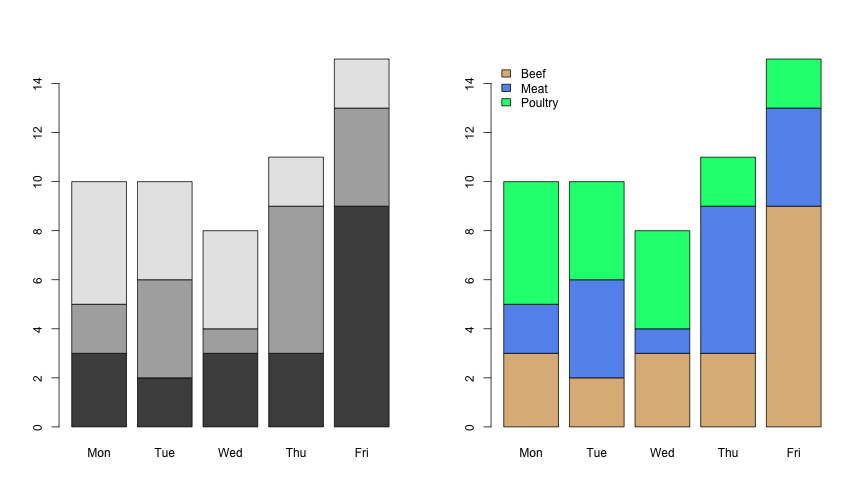
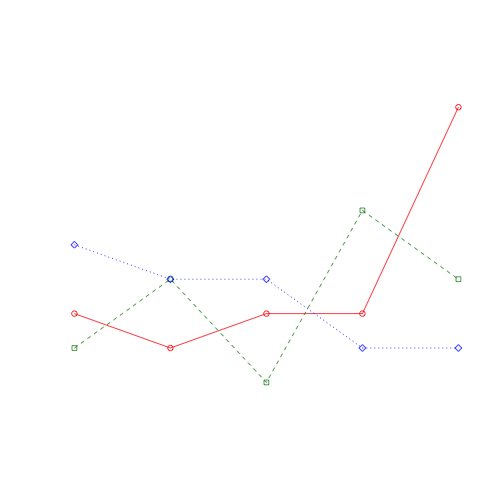

Getting Data In and Summarizing
========================================================
author: Isaac Jenkins
date: February 20, 2014


Workshop Objectives
========================================================
- Start an RStudio Project
- Get an Excel file into R
- Summarize the data **numerically**
- Summarize the data **graphically**
- Abuse the **Base** plotting system
- Practice using R functions

RStudio Projects
========================================================
type: section

Create an RStudio Project
========================================================
- [RStudio Projects](http://www.rstudio.com/ide/docs/using/projects) are handy!
- Let's make one for today's workshop


The Magical Working Directory
========================================================

```r
getwd()
```


```
[1] "/Users/isaac/r_ws_day3"
```


Today, Use the Scripting Window
========================================================
type: alert
- Ctrl + Enter will send the current line to the Console and run it
- You can also highlight several lines and use Ctrl + Enter to send that 
chunk to the Console
- Try it now...
  1. Open a new R Script
  2. Type **```timestamp()```**
  3. With the cursor on the same line, press Ctrl + Enter
  4. Highlight **```timestamp()```** and press Ctrl + Enter
  

```r
timestamp()
```

```
##------ Thu Feb 20 07:55:08 2014 ------##
```


How do we get this into R?
========================================================
type: section


Save Excel File as CSV File
========================================================
If you want...
- Get the excel file
**[here](http://icj.github.io/R_Workshop/materials/day3/hotdog.xlsx)**
- Open in Excel (or Libre Office)
- Go to File>Save as... and choose the comma separated values (csv) format 
- Call it **hotdog.csv** and save it in your working directory

Or, Just Download the CSV File
========================================================
- Get the csv file
**[here](http://icj.github.io/R_Workshop/materials/day3/hotdog.csv)**
- Copy the csv file to your working directory using your preferred method 
(e.g., file explorer, Terminal, Finder)
- Or, copy it to your working directory using R (assuming file is in default 
Downloads folder)

```r
# On a MAC (or Linux)
file.copy(from = "~/Downloads/hotdog.csv", to = getwd())
# On Windows (change USERNAME and/or drive)
file.copy(from = "C:/Users/USERNAME/Downloads/hotdog.csv", to = getwd())
```

- Check if it's there

```r
file.exists("hotdog.csv")
```

```
[1] TRUE
```


Import the Data
========================================================

```r
# Read IN a CSV file
myFile <- "hotdog.csv"
hd <- read.csv(myFile)
```


Import Challenge
========================================================
type: prompt
1. If possible, open the file 
**[hotdog.xlsx](http://icj.github.io/R_Workshop/materials/day3/hotdog.xlsx)** 
in Excel (or Libre Office, or Google Drive).
2. In R, use ```head(hd)```, ```str(hd)```, and ```tail(hd)``` to see
if the data resembles what is in the excel file.
3. What are some of the problems?

Import Challenge Solutions
========================================================
type: prompt

```r
head(hd)
```

```
  Isaac.s.Daily.Hot.Dog.Consumption       X     X.1      X.2    X.3
1                               Day   Brand    Type Calories Sodium
2                               Mon Nathans    Meat      175    507
3                               Mon Nathans Poultry      129    430
4                               Mon Nathans Poultry      102    542
5                               Mon Nathans Poultry      135    426
6                               Mon Nathans Poultry      142    513
```


Import Challenge Solutions
========================================================
type: prompt

```r
str(hd)
```

```
'data.frame':	57 obs. of  5 variables:
 $ Isaac.s.Daily.Hot.Dog.Consumption: Factor w/ 7 levels "","Day","Fri",..: 2 4 4 4 4 4 4 4 4 4 ...
 $ X                                : Factor w/ 4 levels "","Brand","Nathans",..: 2 3 3 3 3 3 4 4 4 4 ...
 $ X.1                              : Factor w/ 6 levels "Beef","Mean",..: 6 3 4 4 4 4 1 1 1 3 ...
 $ X.2                              : Factor w/ 44 levels "102","106","107",..: 44 29 6 1 9 15 36 24 8 28 ...
 $ X.3                              : Factor w/ 50 levels "144","253","298",..: 50 38 28 43 26 40 46 22 2 30 ...
```


Import Challenge Solutions
========================================================
type: prompt

```r
tail(hd)
```

```
   Isaac.s.Daily.Hot.Dog.Consumption          X   X.1         X.2
52                               Fri OscarMayer  Beef         157
53                               Fri OscarMayer  Beef         131
54                               Fri OscarMayer  Meat         190
55                               Fri OscarMayer  Meat         107
56                                               Mean 145.4444444
57                                              StDev 29.38339068
           X.3
52         440
53         317
54         545
55         144
56 424.8333333
57 95.85636857
```


Import Challenge Solutions
========================================================
type: prompt
Problems

1. All columns read in as factors 
  - no numeric data
2. Calculations at bottom of data are read in
  - too many rows

Import the Data - Second Try
========================================================

```r
hd <- read.csv(myFile, skip = 1, nrows = 54, header = TRUE)
```

- **```skip=```**
  - Tells it to skip this many rows
- **```nrows=```**
  - Tells it how many rows to read in 
- **```header=```**
  - Does the first row contain column names?

Import Challenge
========================================================
type: prompt
1. Confirm that the data was read in correctly.
2. Any other concerns?

Import Challenge Solution
========================================================
type: prompt
The **```Day```** factor is not ordered meaningfully.

```r
str(hd)
```

```
'data.frame':	54 obs. of  5 variables:
 $ Day     : Factor w/ 5 levels "Fri","Mon","Thu",..: 2 2 2 2 2 2 2 2 2 2 ...
 $ Brand   : Factor w/ 2 levels "Nathans","OscarMayer": 1 1 1 1 1 2 2 2 2 2 ...
 $ Type    : Factor w/ 3 levels "Beef","Meat",..: 2 3 3 3 3 1 1 1 2 3 ...
 $ Calories: int  175 129 102 135 142 190 153 132 173 152 ...
 $ Sodium  : int  507 430 542 426 513 587 401 253 458 588 ...
```

```r
levels(hd$Day)
```

```
[1] "Fri" "Mon" "Thu" "Tue" "Wed"
```


Fix Day Factor
========================================================
Want the factor **```Day```** to be in logical order.

```r
levels(hd$Day)
```

```
[1] "Fri" "Mon" "Thu" "Tue" "Wed"
```

```r
hd$Day <- factor(hd$Day, levels = c("Mon", "Tue", "Wed", "Thu", "Fri"))
levels(hd$Day)
```

```
[1] "Mon" "Tue" "Wed" "Thu" "Fri"
```


Band-Aid
========================================================
If you could NOT download the file, RUN this now

```r
myURL <- "http://icj.github.io/R_Workshop/materials/day3/hotdog.csv"
hd <- read.csv(myURL, skip = 1, nrows = 54, header = TRUE)
hd$Day <- factor(hd$Day, levels = c("Mon", "Tue", "Wed", "Thu", "Fri"))
```


Summarizing Data
========================================================
type: section
Numerically & Graphically

Summarizing Frequencies - 1 & 2 Factors
========================================================
The **```table()```** function builds a contingency table of counts for 
combinations of factor levels.

```r
table(hd$Day)
```

```

Mon Tue Wed Thu Fri 
 10  10   8  11  15 
```

```r
table(hd$Brand, hd$Day)
```

```
            
             Mon Tue Wed Thu Fri
  Nathans      5   2   2   4   5
  OscarMayer   5   8   6   7  10
```


Summarizing Frequencies - 3 Factors
========================================================

```r
table(hd$Type, hd$Day, hd$Brand)
```

```
, ,  = Nathans

         
          Mon Tue Wed Thu Fri
  Beef      0   0   0   1   1
  Meat      1   1   0   2   2
  Poultry   4   1   2   1   2

, ,  = OscarMayer

         
          Mon Tue Wed Thu Fri
  Beef      3   2   3   2   8
  Meat      1   3   1   4   2
  Poultry   1   3   2   1   0
```


Table Challenge
========================================================
type: prompt
Run the following commands and comment on what they are doing.

```r
hd.tab <- table(hd$Day, hd$Brand) # This stores the table in hd.tab
hd.tab # This prints the table to the screen
prop.table(hd.tab) # This ...
prop.table(hd.tab, 1) # This ...
prop.table(hd.tab, 2) # This ...
margin.table(hd.tab) # This ...
margin.table(hd.tab, 1) # This ...
margin.table(hd.tab, 2) # This ...
```


Table Challenge Solutions
========================================================
type: prompt

```r
hd.tab <- table(hd$Day, hd$Brand) # This stores the table in hd.tab
hd.tab # This prints the table to the screen
prop.table(hd.tab) # cell percentages
prop.table(hd.tab, 1) # row percentages
prop.table(hd.tab, 2) # column percentages
margin.table(hd.tab) # sum all cells
margin.table(hd.tab, 1) # sum across rows
margin.table(hd.tab, 2) # sum across columns
```


Bar Plots - 1 Variable
========================================================

```r
hd.tab <- table(hd$Type)
barplot(hd.tab)
barplot(hd.tab, horiz = TRUE)
```


Bar Plots - 2 Variables "Stacked"
========================================================

```r
hd.tab <- table(hd$Type, hd$Day)
barplot(hd.tab)
barplot(hd.tab, col = c("burlywood", "cornflowerblue", "springgreen"))
legend("topleft", legend = levels(hd$Type), bty = "n",
       fill = c("burlywood", "cornflowerblue", "springgreen"))
```





Bar Plots - 2 Variables "Beside"
========================================================

```r
hd.tab <- table(hd$Day, hd$Type)
barplot(hd.tab, beside = TRUE)
barplot(hd.tab, beside = TRUE, col = rainbow(5))
legend("topright", legend = levels(hd$Day), bty = "n", fill = rainbow(5))
```


Bar Plot Challenge
========================================================
type: prompt
1. Create a "Beside" bar plot with Brand on the x-axis grouped by Type. 
2. Experiment with adding color and a legend (hint: try ```heat.colors(3)```)

Bar plot Challenge Solution
========================================================
type: prompt

```r
hd.tab <- table(hd$Type, hd$Brand)
barplot(hd.tab, beside = TRUE, col = heat.colors(3))
legend("topleft", legend = levels(hd$Type), bty = "n", fill = heat.colors(3))
```


Summarize with Basic Functions
========================================================

```r
summary(hd)
```

```
  Day            Brand         Type       Calories       Sodium   
 Mon:10   Nathans   :18   Beef   :20   Min.   : 86   Min.   :144  
 Tue:10   OscarMayer:36   Meat   :17   1st Qu.:132   1st Qu.:362  
 Wed: 8                   Poultry:17   Median :145   Median :405  
 Thu:11                                Mean   :145   Mean   :425  
 Fri:15                                3rd Qu.:173   3rd Qu.:504  
                                       Max.   :195   Max.   :645  
```

```r
plot(hd)
```


Summarize with psych
========================================================

```r
require(psych)
describe(hd)
```

```
         var  n   mean    sd median trimmed    mad min max range  skew
Day*       1 54   3.20  1.50      3    3.25   1.48   1   5     4 -0.18
Brand*     2 54   1.67  0.48      2    1.70   0.00   1   2     1 -0.69
Type*      3 54   1.94  0.83      2    1.93   1.48   1   3     2  0.10
Calories   4 54 145.44 29.38    145  146.14  22.24  86 195   109 -0.16
Sodium     5 54 424.83 95.86    405  424.61 108.23 144 645   501 -0.10
         kurtosis    se
Day*        -1.46  0.20
Brand*      -1.56  0.06
Type*       -1.58  0.11
Calories    -0.82  4.00
Sodium       0.03 13.04
```


Summarize with psych
========================================================

```r
pairs.panels(hd)
```


Summarize with Hmisc
========================================================

```r
require(Hmisc)
describe(hd)
```

```
hd 

 5  Variables      54  Observations
---------------------------------------------------------------------------
Day 
      n missing  unique 
     54       0       5 

          Mon Tue Wed Thu Fri
Frequency  10  10   8  11  15
%          19  19  15  20  28
---------------------------------------------------------------------------
Brand 
      n missing  unique 
     54       0       2 

Nathans (18, 33%), OscarMayer (36, 67%) 
---------------------------------------------------------------------------
Type 
      n missing  unique 
     54       0       3 

Beef (20, 37%), Meat (17, 31%), Poultry (17, 31%) 
---------------------------------------------------------------------------
Calories 
      n missing  unique    Mean     .05     .10     .25     .50     .75 
     54       0      41   145.4   97.25  103.20  132.00  145.00  172.75 
    .90     .95 
 185.40  190.00 

lowest :  86  87  94  99 102, highest: 184 186 190 191 195 
---------------------------------------------------------------------------
Sodium 
      n missing  unique    Mean     .05     .10     .25     .50     .75 
     54       0      47   424.8   299.3   319.9   362.5   405.0   503.5 
    .90     .95 
  544.1   583.1 

lowest : 144 253 298 300 317, highest: 545 581 587 588 645 
---------------------------------------------------------------------------
```


Summarize with dplyr
========================================================

```r
# Install package if needed
install.packages("dplyr")
```


```r
require(dplyr)
hd %.%
  group_by(Day) %.%
  summarise(n = length(Type),
            mean.cals = mean(Calories),
            sd.cals = sd(Calories),
            se.cals = sd.cals / sqrt(n),
            misc.stat = mean.cals / mean(Sodium))
```

```
Source: local data frame [5 x 6]

  Day  n mean.cals sd.cals se.cals misc.stat
1 Fri 15     147.3   30.37   7.842    0.3725
2 Thu 11     141.9   29.13   8.784    0.3771
3 Wed  8     147.5   36.78  13.003    0.3061
4 Tue 10     142.0   30.49   9.642    0.3296
5 Mon 10     148.3   26.03   8.230    0.3152
```

See an excellent ```dplyr``` tutorial
[here](http://cran.r-project.org/web/packages/dplyr/vignettes/introduction.html)

dplyr Challenge
========================================================
type: prompt
Use **```dplyr```** to summarize the n, mean, standard deviation and standard 
error of hot dog sodium by **Brand**

**Bonus:** Summarize by **Brand** and **Type**

dplyr Challenge Solution
========================================================
type: prompt

```r
hd %.%
  group_by(Brand) %.%
  summarise(n = length(Type),
            mean.sod = mean(Sodium),
            sd.sod = sd(Sodium),
            se.sod = sd.sod / sqrt(n))
```

```
Source: local data frame [2 x 5]

       Brand  n mean.sod sd.sod se.sod
1 OscarMayer 36    430.4 106.30  17.72
2    Nathans 18    413.8  72.04  16.98
```


dplyr Challenge Bonus Solution
========================================================
type: prompt

```r
hd %.%
  group_by(Brand, Type) %.%
  summarise(n = length(Type),
            mean.sod = mean(Sodium),
            sd.sod = sd(Sodium),
            se.sod = sd.sod / sqrt(n))
```

```
Source: local data frame [6 x 6]
Groups: Brand

       Brand    Type  n mean.sod sd.sod se.sod
1    Nathans    Beef  2    311.0  15.56  11.00
2 OscarMayer Poultry  7    497.3  93.99  35.53
3 OscarMayer    Meat 11    419.2 110.47  33.31
4 OscarMayer    Beef 18    411.2 103.20  24.33
5    Nathans Poultry 10    432.2  70.27  22.22
6    Nathans    Meat  6    417.3  61.55  25.13
```


Histograms
========================================================

```r
hist(hd$Calories)
```


```r
with(hd, hist(Calories, breaks = 10))
```


***


```r
with(hd, hist(Calories))
```


```r
with(hd, hist(Calories, freq = FALSE))
```


Histogram with Density
========================================================

```r
with(hd, hist(Calories, freq = FALSE))
lines(density(hd$Calories), col = "red")
```


Histogram Challenge
========================================================
type: prompt
Plot histograms for sodium by hot dog type (i.e., one each for beef, meat, and 
poultry).

**Hint**: subset the data

Histogram Challenge Solutions
========================================================
type: prompt

```r
with(subset(hd, hd$Type == "Beef"), hist(Sodium, main = "Beef"))
hist(hd$Sodium[hd$Type == "Beef"], main = "Beef")
with(hd[hd$Type == "Beef", ], hist(Sodium, main = "Beef"))
```


```r
with(subset(hd, hd$Type == "Meat"), hist(Sodium, main = "Meat"))
with(subset(hd, hd$Type == "Poultry"), hist(Sodium, main = "Poultry"))
```


Box Plots - Single Vector
========================================================

```r
# Specifying a vector
boxplot(hd$Calories)
```


***


```r
boxplot(hd$Calories, xlab = "Calories", main = "All Hot Dogs")
```


Box Plots - Continuous Variable and a Factor
========================================================

```r
boxplot(Calories ~ Type, data = hd, main = "Calories by Type", 
        xlab = "Hot Dog Type", ylab = "Calories")
```


Box Plots - Continuous Variable and a Factor (Horizontal)
========================================================

```r
boxplot(Calories ~ Type, data = hd, main = "Calories by Type", 
        ylab = "Hot Dog Type", xlab = "Calories", 
        horizontal = TRUE)
```


Box Plots - Continuous Variable and 2 Factors
========================================================

```r
boxplot(Calories ~ Brand * Type, data = hd, main = "Calories", 
        xlab = "Brand and Type")
```


Box Plots - Continuous Variable and 2 Factors (with Color)
========================================================

```r
boxplot(Calories ~ Brand * Type, data = hd, main = "Calories", 
        xlab = "Brand and Type", col = c("green", "red"))
```


Box Plots - Data Frames
========================================================

```r
boxplot(hd)
```


***


```r
boxplot(hd[4:5])
```


Box Plot Challenge
========================================================
type: prompt
Create a box plot of **Sodium** by **Type**. Include the following:

1. A main title
2. Custom x and y axes labels
3. Make it horizontal
4. Different colors for each hot dog type

More colors available 
[here](http://research.stowers-institute.org/efg/R/Color/Chart/ColorChart.pdf)

Box Plot Challenge Solution
========================================================
type: prompt


```r
boxplot(Sodium ~  Type, data = hd, horizontal = TRUE,
        main = "Sodium", xlab = "mg", ylab = "Hot Dog Type",
        col = c("burlywood", "cornflowerblue", "springgreen"))
```


Strip Charts
========================================================
Strip charts are sometimes more useful than box plots (especially when the 
sample size is small).


```r
with(hd, stripchart(Calories))
stripchart(Calories ~ Type, data = hd)
```


More Strip Charts
========================================================

```r
stripchart(Calories ~ Type * Brand, data = hd)
stripchart(Calories ~ Type * Brand, data = hd, method = "jitter", jitter = 0.1)
```


Fix Tick Labels
========================================================

```r
y.ticks <- c("B.N", "M.N", "P.N", "B.OM", "M.OM", "P.OM")
stripchart(Calories ~ Type * Brand, data = hd, yaxt = "n")
axis(2, at = 1:6, labels = y.ticks, las = 2)
```


Scatter Plots
========================================================

```r
plot(Calories ~ Sodium, data = hd)
abline(lm(Calories ~ Sodium, data = hd))
```


Making a Custom Plot
========================================================
type: section

Custom Plots
========================================================
Let's make this plot


Step 1 - Create the Data
========================================================
We need frequency data


```r
with(hd, table(Day, Type))
```

```
     Type
Day   Beef Meat Poultry
  Mon    3    2       5
  Tue    2    4       4
  Wed    3    1       4
  Thu    3    6       2
  Fri    9    4       2
```

```r
hd2 <- data.frame(with(hd, table(Day, Type)))
head(hd2)
```

```
  Day Type Freq
1 Mon Beef    3
2 Tue Beef    2
3 Wed Beef    3
4 Thu Beef    3
5 Fri Beef    9
6 Mon Meat    2
```


Step 2 - Initialize the Plot
========================================================
We use **```plot()```** to open a new plotting window


```r
plot(x = hd2$Freq[hd2$Type == "Beef"], 
     type = "o", col = "red", ylim = c(0, 10), 
     axes = FALSE, ann = FALSE)
```


Step 2 - Initialize the Plot
========================================================


```r
plot(x = hd2$Freq[hd2$Type == "Beef"], 
     type = "o", col = "red", ylim = c(0, 10), 
     axes = FALSE, ann = FALSE)
```


- **```x=```** Points to plot (actually the y values here)
- **```type=```** what type of plot (see **?plot**)
- **```col=```** color of points and/or lines
- **```ylim=```** min and max y-values on y-axis
- **```axes=```** include axes?
- **```ann=```** include annotations?

Step 3 - Add a Layer
========================================================
We use **```lines()```** to add a layer to the current plot


```r
lines(x = hd2$Freq[hd2$Type == "Meat"], 
      type = "o", col = "forestgreen", 
      pch = 22, lty = 2)
```


Step 3 - Add a Layer
========================================================


```r
lines(x = hd2$Freq[hd2$Type == "Meat"], 
      type = "o", col = "forestgreen", 
      pch = 22, lty = 2)
```


- **```x=```** Points to plot (actually the y's again)
- **```type=```** what type of plot (see **?plot**)
- **```col=```** color of points and/or lines
- **```pch=```** point symbol
- **```lty=```** line type

Step 4 - Add another Layer
========================================================


```r
lines(x = hd2$Freq[hd2$Type == "Poultry"], 
      type = "o", col = "blue", 
      pch = 23, lty = 3)
```





Step 5 - Add a Main Title
========================================================
We use **```title()```** to add labels to the current plot


```r
title(main = "Isaac's Weekly Hot Dog Consumption", 
      col.main = "maroon", font.main = 4)
```


Step 5 - Add a Main Title
========================================================


```r
title(main = "Isaac's Weekly Hot Dog Consumption", 
      col.main = "maroon", font.main = 4)
```


- **```main=```** Title text
- **```col.main=```** color for main title
- **```font.main```** font style for main title
  - 1 = plain text
  - 2 = bold
  - 3 = italic
  - 4 = bold and italic
  
Step 6 - Customize the X-axis
========================================================
We use **```axis()```** to specify the axis ticks on the current plot


```r
axis(side = 1, at = 1:5, lab = levels(hd2$Day))
title(xlab = "Days", col.lab = "steelblue", font.lab = 2)
```


Step 6 - Customize the X-axis
========================================================


```r
axis(side = 1, at = 1:5, lab = levels(hd2$Day))
title(xlab = "Days", col.lab = "steelblue", font.lab = 2)
```


- **```axis()```**
  - **```side=```** side of plot (1=below, 2=left, 3=above and 4=right)
  - **```at=```** points where tick marks are drawn
  - **```lab=```** custom tick labels
- **```title()```** font style for main title
  - **```xlab=```** title for x-axis
  - **```col.lab=```** color for x-axis title
  - **```font.lab=```** font style for x-axis title
  
Step 7 - Customize the Y-axis
========================================================


```r
axis(side = 2, las = 1, at = seq(0, 10, 2))
title(ylab = "Devoured", col.lab = 3, font.lab = 2)
```


Step 8 - Add a Legend
========================================================
We use **```legend()```** to add a legend to the current plot


```r
legend(x = 1, y = 10, 
       legend = levels(hd2$Type),                  
       col = c("red", "forestgreen", "blue"),   
       pch = 21:23, lty = 1:3,                                   
       bty = "n", cex = 0.8) 
```


***


Step 8 - Add a Legend (ORDER MATTERS)
========================================================

```r
legend(x = 1, y = 10, 
       legend = levels(hd2$Type),                  
       col = c("red", "forestgreen", "blue"),   
       pch = 21:23, lty = 1:3,                                   
       bty = "n", cex = 0.8) 
```


- **```x=, y=```** position of legend
- **```legend=```** legend text
- **```col=```** color of points and/or lines
- **```pch=```** point symbol
- **```lty=```** line type
- **```bty=```** line type ("o"=box, "n"=no box)
- **```cex=```** magnification of text/symbols

Step 9 - Add Custom Text
========================================================
We use **```text()```** to add text to the current plot


```r
text(x = 3, y = 0.5, lab = "SICK", col = "tomato4")
```


Step 9 - Add Custom Text
========================================================

```r
text(x = 3, y = 0.5, lab = "SICK", col = "tomato4")
```


- **```x=, y=```** position of text
- **```lab=```** text to be written
- **```col=```** color of text

The Final Plot's Code
========================================================

```r
plot(x = hd2$Freq[hd2$Type == "Beef"], 
     type = "o", col = "red", ylim = c(0, 10), 
     axes = FALSE, ann = FALSE)
lines(x = hd2$Freq[hd2$Type == "Meat"], 
      type = "o", col = "forestgreen", 
      pch = 22, lty = 2)
lines(x = hd2$Freq[hd2$Type == "Poultry"], 
      type = "o", col = "blue", 
      pch = 23, lty = 3)
title(main = "Isaac's Weekly Hot Dog Consumption", 
      col.main = "maroon", font.main = 4)
axis(side = 1, at = 1:5, lab = levels(hd2$Day))
title(xlab = "Days", col.lab = "steelblue", font.lab = 2)
axis(2, las = 1, at = seq(0, 10, 2))
title(ylab = "Devoured", col.lab = 3, font.lab = 2)
legend(x = 1, y = 10, 
       legend = levels(hd2$Type),                  
       col = c("red", "forestgreen", "blue"),   
       pch = 21:23, lty = 1:3,                                   
       bty = "n", cex = 0.8) 
text(x = 3, y = 0.5, lab = "SICK", col = "tomato4")
```


The Final Plot
========================================================


Saving a Plot
========================================================
- Export from RStudio
- Or, export from the R console:

```r
# Save as png file
png("my_plot.png", width = 500, height = 500, res = 72)
plot(1:10, 1:10, pch = 1:10, col = 1:10) 
dev.off()
```


```r
# Save as pdf file
pdf("my_plot.pdf", width = 7, height = 7)
plot(1:10, 1:10, pch = 1:10, col = 1:10) 
dev.off()
```


Base Plotting System Review
========================================================
- Plot a *static* layer with ```plot(), barplot(), boxplot()```, etc.
- Plot type varies if x and y are numbers or factors
- Add new layers with ```lines()``` or ```points()```
- Customize titles and axes with ```title()``` or ```axis()```
- Options, such as color or point character, are specified with each layer
- Graphical parameters can also be changed with ```par()```; see ```?par```

Custom Plot Challenge
========================================================
type: prompt
Make this plot


***

**Hint:**

```r
hd3 <- data.frame(with(hd, table(Day, Brand)))
```


Custom Plot Challenge Solution
========================================================
type: prompt

```r
hd3 <- with(hd, data.frame(table(Day, Brand)))
plot(hd3$Freq[hd3$Brand == "Nathans"], 
     type = "o", col = "red", ylim = c(0, 10), 
     axes = FALSE, ann = FALSE)
lines(hd3$Freq[hd3$Brand == "OscarMayer"], 
      type = "o", col = "forestgreen", 
      pch = 22, lty = 2)
title(main = "Isaac Prefers Oscar Mayer Hot Dogs over Nathan's", 
      col.main = "RoyalBlue3", font.main = 4)
axis(1, at = 1:5, lab = levels(hd3$Day))
title(xlab = "Days", col.lab = "steelblue", font.lab = 2)
axis(2, las = 1, at = seq(0, 10, 2))
title(ylab = "Consumed", font.lab = 2)
legend(x = 1, y = 10, 
       legend = levels(hd3$Brand),                  
       col = c("red", "forestgreen"),   
       pch = 21:22, lty = 1:2,                                   
       bty = "n", cex = 0.8)  
text(x = 1, y = 4.65, "Fair", col = "purple4")
```


ggplot2
========================================================
type: section

ggplot2 Teaser
========================================================


***


ggplot2 Teaser Code
========================================================

```r
require(ggplot2)
ggplot(hd2, aes(x = Day, y = Freq, color = Type)) +
  geom_point(aes(shape = Type)) +
  geom_line(aes(group = Type, linetype = Type)) +
  geom_text(aes(x = 3, y = 0.5, label = "SICK"), color = "tomato4") +
  ggtitle("Isaac's Weekly Hot Dog Consumption") +
  xlab("Days") +
  ylab("Devoured") +
  theme(plot.title = element_text(color = "maroon", face = "italic"),
        axis.title.x = element_text(color = "steelblue", face = "bold"),
        axis.title.y = element_text(color = "green", face = "bold"))
```


```r
ggplot(hd3, aes(x = Day, y = Freq, color = Brand)) +
  geom_point(aes(shape = Brand)) +
  geom_line(aes(group = Brand, linetype = Brand)) +
  geom_text(aes(x = 1, y = 4.65, label = "Fair"), color = "purple4") +
  ggtitle("Isaac Prefers Oscar Mayer Hot Dogs over Nathan's") +
  xlab("Days") +
  ylab("Consumed") +
  theme(plot.title = element_text(color = "royalblue3", face = "italic"),
        axis.title.x = element_text(color = "steelblue", face = "bold"),
        axis.title.y = element_text(face = "bold"))
```


Exercises
========================================================
type: alert
- The people at [DataCamp](https://www.datacamp.com/) have a nice
interactive, introductory R tutorial.
- Take an excel file you have and try to get it into R.
- Summarize your data numerically and graphically as we've done today.

Thank you to...
========================================================
- [The R Project for Statistical Computing](http://www.r-project.org)
- [RStudio People](http://www.rstudio.com)
- [BIO5 Institute](http://www.bio5.org/)
- [Southwest Environmental Health Sciences Center](http://swehsc.pharmacy.arizona.edu/)
- [DataCamp](https://www.datacamp.com/)


