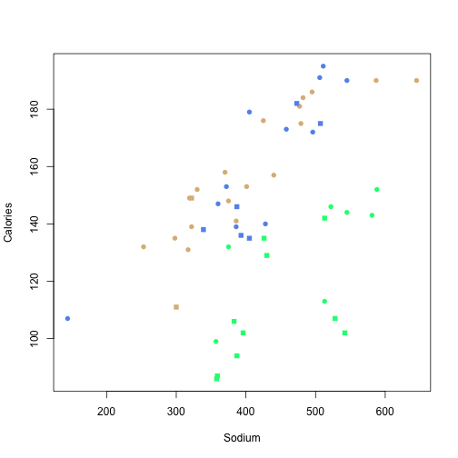

Getting Data In and Summarizing
========================================================
author: Isaac Jenkins
date: February 20, 2014


Workshop Objectives
========================================================
- Start an RStudio Project
- Get an Excel file into R
- Summarize the data **numerically**
- Summarize the data **graphically**
- Abuse the **Base** plotting system
- Practice using R functions

RStudio Projects
========================================================
type: section

Create an RStudio Project
========================================================
- [RStudio Projects](http://www.rstudio.com/ide/docs/using/projects) are handy!
- Let's make one for today's workshop


The Magical Working Directory
========================================================

```r
getwd()
```


```
[1] "/Users/isaac/r_ws_day3"
```


Today, Use the Scripting Window
========================================================
type: alert
- Ctrl + Enter will send the current line to the Console and run it
- You can also highlight several lines and use Ctrl + Enter to send that 
chunk to the Console
- Try it now...
  1. Open a new R Script
  2. Type **```getwd()```**
  3. With the cursor on the same line, press Ctrl + Enter
  4. Highlight **```getwd()```** and press Ctrl + Enter
  

```r
getwd()
```

```
[1] "/Users/isaac/statlab_bb/R_Workshop/index/materials/day3"
```


How do we get this into R?
========================================================
type: section


Save Excel File as CSV File
========================================================
If you want...
- Get the excel file
**[here](http://icj.github.io/R_Workshop/materials/day3/hotdog.xlsx)**
- Open in Excel (or Libre Office)
- Go to File>Save as... and choose the comma separated values (csv) format 
- Call it **hotdog.csv** and save it in your working directory

Or, Just Download the CSV File
========================================================
- Get the csv file
**[here](http://icj.github.io/R_Workshop/materials/day3/hotdog.csv)**
- Copy the csv file to your working directory using your preferred method 
(e.g., file explorer, Terminal, Finder)
- Or, copy it to your working directory using R (assuming file is in default 
Downloads folder)

```r
# On a MAC (or Linux)
file.copy(from = "~/Downloads/hotdog.csv", to = getwd())
# On Windows (change USERNAME and/or drive)
file.copy(from = "C:/Users/USERNAME/Downloads/hotdog.csv", to = getwd())
```

- Check if it's there

```r
file.exists("hotdog.csv")
```

```
[1] TRUE
```


Import the Data
========================================================

```r
# Read IN a CSV file
myFile <- "hotdog.csv"
hd <- read.csv(myFile)
```


Import Challenge
========================================================
type: prompt
1. If possible, open the file 
**[hotdog.xlsx](http://icj.github.io/R_Workshop/materials/day3/hotdog.xlsx)** 
in Excel (or Libre Office, or Google Drive).
2. In R, use ```head(hd)```, ```str(hd)```, and ```tail(hd)``` to see
if the data resembles what is in the excel file.
3. What are some of the problems?

Import Challenge Solutions
========================================================
type: prompt

```r
head(hd)
```

```
  Isaac.s.Daily.Hot.Dog.Consumption       X     X.1      X.2    X.3
1                               Day   Brand    Type Calories Sodium
2                               Mon Nathans    Meat      175    507
3                               Mon Nathans Poultry      129    430
4                               Mon Nathans Poultry      102    542
5                               Mon Nathans Poultry      135    426
6                               Mon Nathans Poultry      142    513
```


Import Challenge Solutions
========================================================
type: prompt

```r
str(hd)
```

```
'data.frame':	57 obs. of  5 variables:
 $ Isaac.s.Daily.Hot.Dog.Consumption: Factor w/ 7 levels "","Day","Fri",..: 2 4 4 4 4 4 4 4 4 4 ...
 $ X                                : Factor w/ 4 levels "","Brand","Nathans",..: 2 3 3 3 3 3 4 4 4 4 ...
 $ X.1                              : Factor w/ 6 levels "Beef","Mean",..: 6 3 4 4 4 4 1 1 1 3 ...
 $ X.2                              : Factor w/ 44 levels "102","106","107",..: 44 29 6 1 9 15 36 24 8 28 ...
 $ X.3                              : Factor w/ 50 levels "144","253","298",..: 50 38 28 43 26 40 46 22 2 30 ...
```


Import Challenge Solutions
========================================================
type: prompt

```r
tail(hd)
```

```
   Isaac.s.Daily.Hot.Dog.Consumption          X   X.1         X.2
52                               Fri OscarMayer  Beef         157
53                               Fri OscarMayer  Beef         131
54                               Fri OscarMayer  Meat         190
55                               Fri OscarMayer  Meat         107
56                                               Mean 145.4444444
57                                              StDev 29.38339068
           X.3
52         440
53         317
54         545
55         144
56 424.8333333
57 95.85636857
```


Import Challenge Solutions
========================================================
type: prompt
Problems

1. All columns read in as factors 
  - no numeric data
2. Calculations at bottom of data are read in
  - too many rows

Import the Data - Second Try
========================================================

```r
hd <- read.csv(myFile, skip = 1, nrows = 54, header = TRUE)
```

- **```skip=```**
  - Tells it to skip this many rows
- **```nrows=```**
  - Tells it how many rows to read in 
- **```header=```**
  - Does the first row contain column names?

Import Challenge
========================================================
type: prompt
1. Confirm that the data was read in correctly.
2. Any other concerns?

Import Challenge Solution
========================================================
type: prompt
The **```Day```** factor is not ordered meaningfully.

```r
str(hd)
```

```
'data.frame':	54 obs. of  5 variables:
 $ Day     : Factor w/ 5 levels "Fri","Mon","Thu",..: 2 2 2 2 2 2 2 2 2 2 ...
 $ Brand   : Factor w/ 2 levels "Nathans","OscarMayer": 1 1 1 1 1 2 2 2 2 2 ...
 $ Type    : Factor w/ 3 levels "Beef","Meat",..: 2 3 3 3 3 1 1 1 2 3 ...
 $ Calories: int  175 129 102 135 142 190 153 132 173 152 ...
 $ Sodium  : int  507 430 542 426 513 587 401 253 458 588 ...
```

```r
levels(hd$Day)
```

```
[1] "Fri" "Mon" "Thu" "Tue" "Wed"
```


Fix Day Factor
========================================================
Want the factor **```Day```** to be in logical order.

```r
levels(hd$Day)
```

```
[1] "Fri" "Mon" "Thu" "Tue" "Wed"
```

```r
hd$Day <- factor(hd$Day, levels = c("Mon", "Tue", "Wed", "Thu", "Fri"))
levels(hd$Day)
```

```
[1] "Mon" "Tue" "Wed" "Thu" "Fri"
```


Band-Aid
========================================================
If you could NOT download the file, RUN this now

```r
myURL <- "http://icj.github.io/R_Workshop/materials/day3/hotdog.csv"
hd <- read.csv(myURL, skip = 1, nrows = 54, header = TRUE)
hd$Day <- factor(hd$Day, levels = c("Mon", "Tue", "Wed", "Thu", "Fri"))
```


Summarizing Data
========================================================
type: section
Numerically & Graphically

What is this Data?
========================================================

```r
hd
```

```
   Day      Brand    Type Calories Sodium
1  Mon    Nathans    Meat      175    507
2  Mon    Nathans Poultry      129    430
3  Mon    Nathans Poultry      102    542
4  Mon    Nathans Poultry      135    426
5  Mon    Nathans Poultry      142    513
6  Mon OscarMayer    Beef      190    587
7  Mon OscarMayer    Beef      153    401
8  Mon OscarMayer    Beef      132    253
9  Mon OscarMayer    Meat      173    458
10 Mon OscarMayer Poultry      152    588
11 Tue    Nathans    Meat      146    387
12 Tue    Nathans Poultry      102    396
13 Tue OscarMayer    Beef      184    482
14 Tue OscarMayer    Beef      139    322
15 Tue OscarMayer    Meat      172    496
16 Tue OscarMayer    Meat      179    405
17 Tue OscarMayer    Meat      140    428
18 Tue OscarMayer Poultry       99    357
19 Tue OscarMayer Poultry      113    513
20 Tue OscarMayer Poultry      146    522
21 Wed    Nathans Poultry       87    359
22 Wed    Nathans Poultry      107    528
23 Wed OscarMayer    Beef      181    477
24 Wed OscarMayer    Beef      175    479
25 Wed OscarMayer    Beef      148    375
26 Wed OscarMayer    Meat      195    511
27 Wed OscarMayer Poultry      143    581
28 Wed OscarMayer Poultry      144    545
29 Thu    Nathans    Beef      111    300
30 Thu    Nathans    Meat      182    473
31 Thu    Nathans    Meat      136    393
32 Thu    Nathans Poultry       86    358
33 Thu OscarMayer    Beef      149    319
34 Thu OscarMayer    Beef      135    298
35 Thu OscarMayer    Meat      191    506
36 Thu OscarMayer    Meat      147    360
37 Thu OscarMayer    Meat      139    386
38 Thu OscarMayer    Meat      153    372
39 Thu OscarMayer Poultry      132    375
40 Fri    Nathans    Beef      149    322
41 Fri    Nathans    Meat      135    405
42 Fri    Nathans    Meat      138    339
43 Fri    Nathans Poultry      106    383
44 Fri    Nathans Poultry       94    387
45 Fri OscarMayer    Beef      186    495
46 Fri OscarMayer    Beef      176    425
47 Fri OscarMayer    Beef      158    370
48 Fri OscarMayer    Beef      152    330
49 Fri OscarMayer    Beef      141    386
50 Fri OscarMayer    Beef      190    645
51 Fri OscarMayer    Beef      157    440
52 Fri OscarMayer    Beef      131    317
53 Fri OscarMayer    Meat      190    545
54 Fri OscarMayer    Meat      107    144
```


Summarizing Frequencies - 1 & 2 Factors
========================================================
The **```table()```** function builds a contingency table of counts for 
combinations of factor levels.

```r
table(hd$Day)
```

```

Mon Tue Wed Thu Fri 
 10  10   8  11  15 
```

```r
table(hd$Brand, hd$Day)
```

```
            
             Mon Tue Wed Thu Fri
  Nathans      5   2   2   4   5
  OscarMayer   5   8   6   7  10
```


Summarizing Frequencies - 3 Factors
========================================================

```r
table(hd$Type, hd$Day, hd$Brand)
```

```
, ,  = Nathans

         
          Mon Tue Wed Thu Fri
  Beef      0   0   0   1   1
  Meat      1   1   0   2   2
  Poultry   4   1   2   1   2

, ,  = OscarMayer

         
          Mon Tue Wed Thu Fri
  Beef      3   2   3   2   8
  Meat      1   3   1   4   2
  Poultry   1   3   2   1   0
```


Table Challenge
========================================================
type: prompt
Run the following commands and comment on what they are doing.

```r
hd.tab <- table(hd$Day, hd$Brand) # This stores the table in hd.tab
hd.tab # This prints the table to the screen
prop.table(hd.tab) # This ...
prop.table(hd.tab, 1) # This ...
prop.table(hd.tab, 2) # This ...
margin.table(hd.tab) # This ...
margin.table(hd.tab, 1) # This ...
margin.table(hd.tab, 2) # This ...
```


Table Challenge Solutions
========================================================
type: prompt

```r
hd.tab <- table(hd$Day, hd$Brand) # This stores the table in hd.tab
hd.tab # This prints the table to the screen
prop.table(hd.tab) # cell percentages
prop.table(hd.tab, 1) # row percentages
prop.table(hd.tab, 2) # column percentages
margin.table(hd.tab) # sum all cells
margin.table(hd.tab, 1) # sum across rows
margin.table(hd.tab, 2) # sum across columns
```


Bar Plots - 1 Variable
========================================================

```r
hd.tab <- table(hd$Type)
barplot(hd.tab)
barplot(hd.tab, horiz = TRUE)
```


Bar Plots - 2 Variables "Stacked"
========================================================

```r
hd.tab <- table(hd$Type, hd$Day)
barplot(hd.tab)
barplot(hd.tab, col = c("burlywood", "cornflowerblue", "springgreen"))
legend("topleft", legend = levels(hd$Type), bty = "n",
       fill = c("burlywood", "cornflowerblue", "springgreen"))
```


Bar Plots - 2 Variables "Beside"
========================================================

```r
hd.tab <- table(hd$Day, hd$Type)
barplot(hd.tab, beside = TRUE)
barplot(hd.tab, beside = TRUE, col = rainbow(5))
legend("topright", legend = levels(hd$Day), bty = "n", fill = rainbow(5))
```


Bar Plot Challenge
========================================================
type: prompt
1. Create a "Beside" bar plot with Brand on the x-axis grouped by Type. 
2. Experiment with adding color and a legend (hint: try ```heat.colors(3)```)

Bar plot Challenge Solution
========================================================
type: prompt

```r
hd.tab <- table(hd$Type, hd$Brand)
barplot(hd.tab, beside = TRUE, col = heat.colors(3))
legend("topleft", legend = levels(hd$Type), bty = "n", fill = heat.colors(3))
```


Summarize with Basic Functions
========================================================

```r
summary(hd)
```

```
  Day            Brand         Type       Calories       Sodium   
 Mon:10   Nathans   :18   Beef   :20   Min.   : 86   Min.   :144  
 Tue:10   OscarMayer:36   Meat   :17   1st Qu.:132   1st Qu.:362  
 Wed: 8                   Poultry:17   Median :145   Median :405  
 Thu:11                                Mean   :145   Mean   :425  
 Fri:15                                3rd Qu.:173   3rd Qu.:504  
                                       Max.   :195   Max.   :645  
```

```r
plot(hd)
```


Summarize with psych
========================================================

```r
require(psych)
describe(hd)
```

```
         var  n   mean    sd median trimmed    mad min max range  skew
Day*       1 54   3.20  1.50      3    3.25   1.48   1   5     4 -0.18
Brand*     2 54   1.67  0.48      2    1.70   0.00   1   2     1 -0.69
Type*      3 54   1.94  0.83      2    1.93   1.48   1   3     2  0.10
Calories   4 54 145.44 29.38    145  146.14  22.24  86 195   109 -0.16
Sodium     5 54 424.83 95.86    405  424.61 108.23 144 645   501 -0.10
         kurtosis    se
Day*        -1.46  0.20
Brand*      -1.56  0.06
Type*       -1.58  0.11
Calories    -0.82  4.00
Sodium       0.03 13.04
```


Summarize with psych
========================================================

```r
pairs.panels(hd)
```


Summarize with Hmisc
========================================================

```r
require(Hmisc)
describe(hd)
```

```
hd 

 5  Variables      54  Observations
---------------------------------------------------------------------------
Day 
      n missing  unique 
     54       0       5 

          Mon Tue Wed Thu Fri
Frequency  10  10   8  11  15
%          19  19  15  20  28
---------------------------------------------------------------------------
Brand 
      n missing  unique 
     54       0       2 

Nathans (18, 33%), OscarMayer (36, 67%) 
---------------------------------------------------------------------------
Type 
      n missing  unique 
     54       0       3 

Beef (20, 37%), Meat (17, 31%), Poultry (17, 31%) 
---------------------------------------------------------------------------
Calories 
      n missing  unique    Mean     .05     .10     .25     .50     .75 
     54       0      41   145.4   97.25  103.20  132.00  145.00  172.75 
    .90     .95 
 185.40  190.00 

lowest :  86  87  94  99 102, highest: 184 186 190 191 195 
---------------------------------------------------------------------------
Sodium 
      n missing  unique    Mean     .05     .10     .25     .50     .75 
     54       0      47   424.8   299.3   319.9   362.5   405.0   503.5 
    .90     .95 
  544.1   583.1 

lowest : 144 253 298 300 317, highest: 545 581 587 588 645 
---------------------------------------------------------------------------
```


Summarize with dplyr
========================================================

```r
# Install package if needed
install.packages("dplyr")
```


```r
require(dplyr)
hd %.%
  group_by(Day) %.%
  summarise(n = length(Type),
            mean.cals = mean(Calories),
            sd.cals = sd(Calories),
            se.cals = sd.cals / sqrt(n),
            misc.stat = mean.cals / mean(Sodium))
```

```
Source: local data frame [5 x 6]

  Day  n mean.cals sd.cals se.cals misc.stat
1 Fri 15     147.3   30.37   7.842    0.3725
2 Thu 11     141.9   29.13   8.784    0.3771
3 Wed  8     147.5   36.78  13.003    0.3061
4 Tue 10     142.0   30.49   9.642    0.3296
5 Mon 10     148.3   26.03   8.230    0.3152
```

See an excellent ```dplyr``` tutorial
[here](http://cran.r-project.org/web/packages/dplyr/vignettes/introduction.html)

dplyr Challenge
========================================================
type: prompt
Use **```dplyr```** to summarize the n, mean, standard deviation and standard 
error of hot dog sodium by **Brand**

**Bonus:** Summarize by **Brand** and **Type**

dplyr Challenge Solution
========================================================
type: prompt

```r
hd %.%
  group_by(Brand) %.%
  summarise(n = length(Type),
            mean.sod = mean(Sodium),
            sd.sod = sd(Sodium),
            se.sod = sd.sod / sqrt(n))
```

```
Source: local data frame [2 x 5]

       Brand  n mean.sod sd.sod se.sod
1 OscarMayer 36    430.4 106.30  17.72
2    Nathans 18    413.8  72.04  16.98
```


dplyr Challenge Bonus Solution
========================================================
type: prompt

```r
hd %.%
  group_by(Brand, Type) %.%
  summarise(n = length(Type),
            mean.sod = mean(Sodium),
            sd.sod = sd(Sodium),
            se.sod = sd.sod / sqrt(n))
```

```
Source: local data frame [6 x 6]
Groups: Brand

       Brand    Type  n mean.sod sd.sod se.sod
1    Nathans    Beef  2    311.0  15.56  11.00
2 OscarMayer Poultry  7    497.3  93.99  35.53
3 OscarMayer    Meat 11    419.2 110.47  33.31
4 OscarMayer    Beef 18    411.2 103.20  24.33
5    Nathans Poultry 10    432.2  70.27  22.22
6    Nathans    Meat  6    417.3  61.55  25.13
```


Histograms
========================================================

```r
hist(hd$Calories)
```


```r
with(hd, hist(Calories, breaks = 10))
```


***


```r
with(hd, hist(Calories))
```


```r
with(hd, hist(Calories, freq = FALSE))
```


Histogram with Density
========================================================

```r
with(hd, hist(Calories, freq = FALSE))
lines(density(hd$Calories), col = "red")
```


Histogram Challenge
========================================================
type: prompt
Plot histograms for sodium by hot dog type (i.e., one each for beef, meat, and 
poultry).

**Hint**: subset the data

Histogram Challenge Solutions
========================================================
type: prompt

```r
with(subset(hd, hd$Type == "Beef"), hist(Sodium, main = "Beef"))
hist(hd$Sodium[hd$Type == "Beef"], main = "Beef")
with(hd[hd$Type == "Beef", ], hist(Sodium, main = "Beef"))
```


```r
with(subset(hd, hd$Type == "Meat"), hist(Sodium, main = "Meat"))
with(subset(hd, hd$Type == "Poultry"), hist(Sodium, main = "Poultry"))
```


Box Plots - Single Vector
========================================================

```r
# Specifying a vector
boxplot(hd$Calories)
```


***


```r
boxplot(hd$Calories, xlab = "Calories", main = "All Hot Dogs")
```


Box Plots - Continuous Variable and a Factor
========================================================

```r
boxplot(Calories ~ Type, data = hd, main = "Calories by Type", 
        xlab = "Hot Dog Type", ylab = "Calories")
```


Box Plots - Continuous Variable and a Factor (Horizontal)
========================================================

```r
boxplot(Calories ~ Type, data = hd, main = "Calories by Type", 
        ylab = "Hot Dog Type", xlab = "Calories", 
        horizontal = TRUE)
```


Box Plots - Continuous Variable and 2 Factors
========================================================

```r
boxplot(Calories ~ Brand * Type, data = hd, main = "Calories", 
        xlab = "Brand and Type")
```


Box Plots - Continuous Variable and 2 Factors (with Color)
========================================================

```r
boxplot(Calories ~ Brand * Type, data = hd, main = "Calories", 
        xlab = "Brand and Type", col = c("green", "red"))
```


Box Plots - Data Frames
========================================================

```r
boxplot(hd)
```


***


```r
boxplot(hd[4:5])
```


Box Plot Challenge
========================================================
type: prompt
Create a box plot of **Sodium** by **Type**. Include the following:

1. A main title
2. Custom x and y axes labels
3. Make it horizontal
4. Different colors for each hot dog type

More colors available 
[here](http://research.stowers-institute.org/efg/R/Color/Chart/ColorChart.pdf)

Box Plot Challenge Solution
========================================================
type: prompt


```r
boxplot(Sodium ~  Type, data = hd, horizontal = TRUE,
        main = "Sodium", xlab = "mg", ylab = "Hot Dog Type",
        col = c("burlywood", "cornflowerblue", "springgreen"))
```


Strip Charts
========================================================
Strip charts are sometimes more useful than box plots (especially when the 
sample size is small).


```r
with(hd, stripchart(Calories))
stripchart(Calories ~ Type, data = hd)
```


More Strip Charts
========================================================

```r
stripchart(Calories ~ Type * Brand, data = hd)
stripchart(Calories ~ Type * Brand, data = hd, method = "jitter", jitter = 0.1)
```


Fix Tick Labels
========================================================

```r
y.ticks <- c("B.N", "M.N", "P.N", "B.OM", "M.OM", "P.OM")
stripchart(Calories ~ Type * Brand, data = hd, yaxt = "n")
axis(2, at = 1:6, labels = y.ticks, las = 2)
```


Scatter Plots
========================================================

```r
plot(Calories ~ Sodium, data = hd, 
     pch = c(15, 16)[hd$Brand],
     col = c("burlywood", "cornflowerblue", "springgreen")[hd$Type])
```




Scatter Plots - Extra
========================================================

```r
abline(lm(Calories ~ Sodium, data = hd))
legend("topleft", legend = c(levels(hd$Type), levels(hd$Brand)),
       pch = c(rep(13, 3), 15, 16),
       col = c("burlywood", "cornflowerblue", "springgreen", "black", "black"),
       bty = "n")
```


Scatter Plot Challenge
========================================================
type: prompt
Create a scatter plot of **Sodium** and **Calories**. Include the following:

1. Sodium on the y-axis, Calories on the x-axis
2. A main title
3. Different colors for each brand
4. Different shapes (```pch```) for each day

**Bonus**: Add a line of best fit and a legend

Scatter Plot Challenge Solution
========================================================
type: prompt


```r
plot(Sodium ~ Calories, data = hd, 
     pch = c(15, 16, 17, 18, 19)[hd$Day],
     col = c("green", "red")[hd$Brand])
```


Scatter Plot Challenge Bonus Solution
========================================================
type: prompt


```r
abline(lm(Sodium ~ Calories, data = hd))
legend("topleft", legend = c(levels(hd$Brand), levels(hd$Day)),
       pch = c(13, 13, 15:19),
       col = c("red", "green", rep("black", 5)),
       bty = "n")
```


Exercises
========================================================
type: alert
- The people at [DataCamp](https://www.datacamp.com/) have a nice
interactive, introductory R tutorial.
- Take an excel file you have and try to get it into R.
- Summarize your data numerically and graphically as we've done today.

Thank you to...
========================================================
- [The R Project for Statistical Computing](http://www.r-project.org)
- [RStudio People](http://www.rstudio.com)
- [BIO5 Institute](http://www.bio5.org/)
- [Southwest Environmental Health Sciences Center](http://swehsc.pharmacy.arizona.edu/)
- [DataCamp](https://www.datacamp.com/)

R Session Info
========================================================

```
R version 3.0.2 (2013-09-25)
Platform: x86_64-apple-darwin10.8.0 (64-bit)

locale:
[1] en_US.UTF-8/en_US.UTF-8/en_US.UTF-8/C/en_US.UTF-8/en_US.UTF-8

attached base packages:
[1] splines   grid      stats     graphics  grDevices utils     datasets 
[8] methods   base     

other attached packages:
[1] psych_1.3.10.12 Hmisc_3.13-0    survival_2.37-4 lattice_0.20-24
[5] ggplot2_0.9.3.1 Formula_1.1-1   dplyr_0.1.1     cluster_1.14.4 
[9] knitr_1.5      

loaded via a namespace (and not attached):
 [1] assertthat_0.1     colorspace_1.2-4   dichromat_2.0-0   
 [4] digest_0.6.4       evaluate_0.5.1     formatR_0.10      
 [7] gtable_0.1.2       labeling_0.2       MASS_7.3-29       
[10] munsell_0.4.2      plyr_1.8           proto_0.3-10      
[13] RColorBrewer_1.0-5 Rcpp_0.10.6        reshape2_1.2.2    
[16] scales_0.2.3       stringr_0.6.2      tools_3.0.2       
```


