Custom Plots and ggplot2
========================================================
author: Isaac Jenkins
date: February 27, 2014


Workshop Objectives
========================================================
- On your own (or with a partner):
  - Load **Hot Dog** data
  - Make box plots and scatter plots
- Make a custom plot
- Introduce the **```ggplot2```** package

Box Plots and Scatter Plots
========================================================
type: prompt
- Complete the 
[Box Plot and Scatter Plot worksheet](http://icj.github.io/R_Workshop/materials/day4/exercises/day4_onyourown.pdf) 
with a partner
- Flag me down for help or reference the 
[Getting Data In and Summarizing](http://icj.github.io/R_Workshop/materials/day3/day3_slides.html#/)
slides
- When finished, check the 
[solutions](http://icj.github.io/R_Workshop/materials/day4/exercises/solutions/day4_ownsolutions.pdf)

Making a Custom Plot
========================================================
type: section

If needed, quickly load the hot dog data:

```r
myURL <- "http://icj.github.io/R_Workshop/materials/day3/hotdog.csv"
hd <- read.csv(myURL, skip = 1, nrows = 54, header = TRUE)
hd$Day <- factor(hd$Day, levels = c("Mon", "Tue", "Wed", "Thu", "Fri"))
```


Custom Plots
========================================================
Let's make this plot

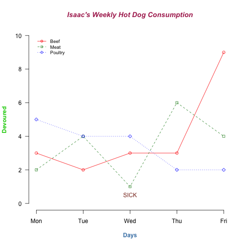


Step 1 - Create the Data
========================================================
We need frequency data


```r
with(hd, table(Day, Type))
```

```
     Type
Day   Beef Meat Poultry
  Mon    3    2       5
  Tue    2    4       4
  Wed    3    1       4
  Thu    3    6       2
  Fri    9    4       2
```

```r
hd2 <- data.frame(with(hd, table(Day, Type)))
head(hd2)
```

```
  Day Type Freq
1 Mon Beef    3
2 Tue Beef    2
3 Wed Beef    3
4 Thu Beef    3
5 Fri Beef    9
6 Mon Meat    2
```


Step 2 - Initialize the Plot
========================================================
We use **```plot()```** to open a new plotting window


```r
plot(x = hd2$Freq[hd2$Type == "Beef"], 
     type = "o", col = "red", ylim = c(0, 10), 
     axes = FALSE, ann = FALSE)
```

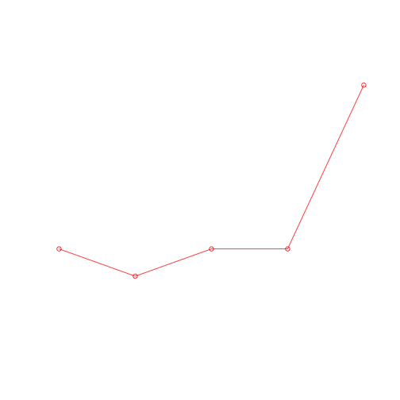


Step 2 - Initialize the Plot
========================================================


```r
plot(x = hd2$Freq[hd2$Type == "Beef"], 
     type = "o", col = "red", ylim = c(0, 10), 
     axes = FALSE, ann = FALSE)
```


- **```x=```** Points to plot (actually the y values here)
- **```type=```** what type of plot (see **?plot**)
- **```col=```** color of points and/or lines
- **```ylim=```** min and max y-values on y-axis
- **```axes=```** include axes?
- **```ann=```** include annotations?

Step 3 - Add a Layer
========================================================
We use **```lines()```** to add a layer to the current plot


```r
lines(x = hd2$Freq[hd2$Type == "Meat"], 
      type = "o", col = "forestgreen", 
      pch = 22, lty = 2)
```


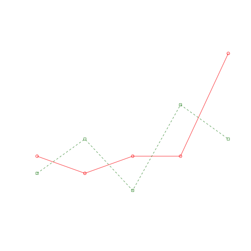


Step 3 - Add a Layer
========================================================


```r
lines(x = hd2$Freq[hd2$Type == "Meat"], 
      type = "o", col = "forestgreen", 
      pch = 22, lty = 2)
```


- **```x=```** Points to plot (actually the y's again)
- **```type=```** what type of plot (see **?plot**)
- **```col=```** color of points and/or lines
- **```pch=```** point symbol
- **```lty=```** line type

Step 4 - Add another Layer
========================================================


```r
lines(x = hd2$Freq[hd2$Type == "Poultry"], 
      type = "o", col = "blue", 
      pch = 23, lty = 3)
```


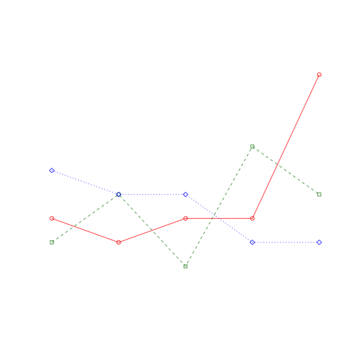


Step 5 - Add a Main Title
========================================================
We use **```title()```** to add labels to the current plot


```r
title(main = "Isaac's Weekly Hot Dog Consumption", 
      col.main = "maroon", font.main = 4)
```


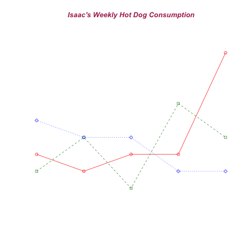


Step 5 - Add a Main Title
========================================================


```r
title(main = "Isaac's Weekly Hot Dog Consumption", 
      col.main = "maroon", font.main = 4)
```


- **```main=```** Title text
- **```col.main=```** color for main title
- **```font.main```** font style for main title
  - 1 = plain text
  - 2 = bold
  - 3 = italic
  - 4 = bold and italic
  
Step 6 - Customize the X-axis
========================================================
We use **```axis()```** to specify the axis ticks on the current plot


```r
axis(side = 1, at = 1:5, lab = levels(hd2$Day))
title(xlab = "Days", col.lab = "steelblue", font.lab = 2)
```


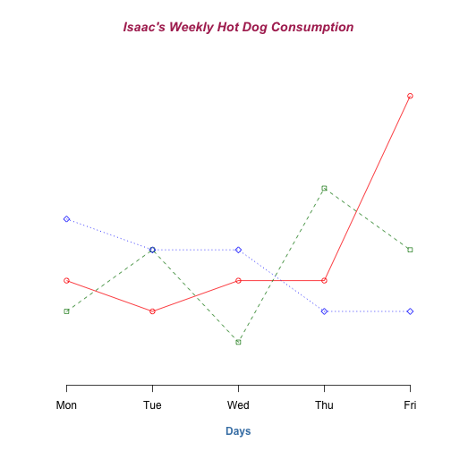


Step 6 - Customize the X-axis
========================================================


```r
axis(side = 1, at = 1:5, lab = levels(hd2$Day))
title(xlab = "Days", col.lab = "steelblue", font.lab = 2)
```


- **```axis()```**
  - **```side=```** side of plot (1=below, 2=left, 3=above and 4=right)
  - **```at=```** points where tick marks are drawn
  - **```lab=```** custom tick labels
- **```title()```** font style for main title
  - **```xlab=```** title for x-axis
  - **```col.lab=```** color for x-axis title
  - **```font.lab=```** font style for x-axis title
  
Step 7 - Customize the Y-axis
========================================================


```r
axis(side = 2, las = 1, at = seq(0, 10, 2))
title(ylab = "Devoured", col.lab = 3, font.lab = 2)
```


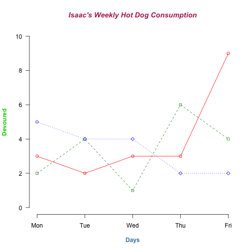


Step 8 - Add a Legend
========================================================
We use **```legend()```** to add a legend to the current plot


```r
legend(x = 1, y = 10, 
       legend = levels(hd2$Type),                  
       col = c("red", "forestgreen", "blue"),   
       pch = 21:23, lty = 1:3,                                   
       bty = "n", cex = 0.8) 
```


***

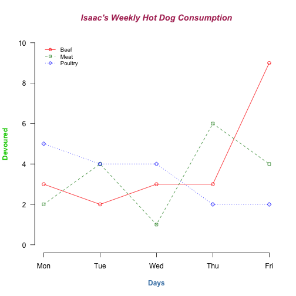


Step 8 - Add a Legend (ORDER MATTERS)
========================================================

```r
legend(x = 1, y = 10, 
       legend = levels(hd2$Type),                  
       col = c("red", "forestgreen", "blue"),   
       pch = 21:23, lty = 1:3,                                   
       bty = "n", cex = 0.8) 
```


- **```x=, y=```** position of legend
- **```legend=```** legend text
- **```col=```** color of points and/or lines
- **```pch=```** point symbol
- **```lty=```** line type
- **```bty=```** box type around legend ("o"=box, "n"=no box)
- **```cex=```** magnification of text/symbols

Step 9 - Add Custom Text
========================================================
We use **```text()```** to add text to the current plot


```r
text(x = 3, y = 0.5, lab = "SICK", col = "tomato4")
```


Step 9 - Add Custom Text
========================================================

```r
text(x = 3, y = 0.5, lab = "SICK", col = "tomato4")
```


- **```x=, y=```** position of text
- **```lab=```** text to be written
- **```col=```** color of text

The Final Plot's Code
========================================================

```r
plot(x = hd2$Freq[hd2$Type == "Beef"], 
     type = "o", col = "red", ylim = c(0, 10), 
     axes = FALSE, ann = FALSE)
lines(x = hd2$Freq[hd2$Type == "Meat"], 
      type = "o", col = "forestgreen", 
      pch = 22, lty = 2)
lines(x = hd2$Freq[hd2$Type == "Poultry"], 
      type = "o", col = "blue", 
      pch = 23, lty = 3)
title(main = "Isaac's Weekly Hot Dog Consumption", 
      col.main = "maroon", font.main = 4)
axis(side = 1, at = 1:5, lab = levels(hd2$Day))
title(xlab = "Days", col.lab = "steelblue", font.lab = 2)
axis(2, las = 1, at = seq(0, 10, 2))
title(ylab = "Devoured", col.lab = 3, font.lab = 2)
legend(x = 1, y = 10, 
       legend = levels(hd2$Type),                  
       col = c("red", "forestgreen", "blue"),   
       pch = 21:23, lty = 1:3,                                   
       bty = "n", cex = 0.8) 
text(x = 3, y = 0.5, lab = "SICK", col = "tomato4")
```


The Final Plot
========================================================


Base Plotting System Review
========================================================
- Plot a *static* layer with ```plot(), barplot(), boxplot()```, etc.
- Plot type varies if x and y are numbers or factors
- Add new layers with ```lines()``` or ```points()```
- Customize titles and axes with ```title()``` or ```axis()```
- Options, such as color or point character, are specified with each layer
- Graphical parameters can also be changed with ```par()```; see ```?par```

Saving a Plot
========================================================
- Export from RStudio
- Or, export from the R console:

```r
# Save as png file
png("my_plot.png", width = 500, height = 500, res = 72)
plot(1:10, 1:10, pch = 1:10, col = 1:10) 
dev.off()
```


```r
# Save as pdf file
pdf("my_plot.pdf", width = 7, height = 7)
plot(1:10, 1:10, pch = 1:10, col = 1:10) 
dev.off()
```


Custom Plot Challenge
========================================================
type: prompt
Make this plot

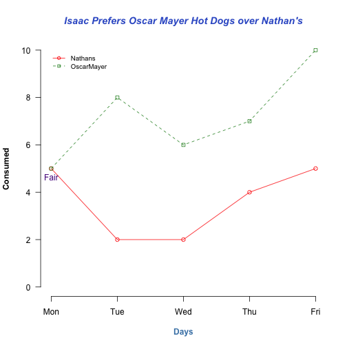


***

**Hint:**

```r
hd3 <- data.frame(with(hd, table(Day, Brand)))
```


Custom Plot Challenge Solution
========================================================
type: prompt

```r
hd3 <- with(hd, data.frame(table(Day, Brand)))
plot(hd3$Freq[hd3$Brand == "Nathans"], 
     type = "o", col = "red", ylim = c(0, 10), 
     axes = FALSE, ann = FALSE)
lines(hd3$Freq[hd3$Brand == "OscarMayer"], 
      type = "o", col = "forestgreen", 
      pch = 22, lty = 2)
title(main = "Isaac Prefers Oscar Mayer Hot Dogs over Nathan's", 
      col.main = "RoyalBlue3", font.main = 4)
axis(1, at = 1:5, lab = levels(hd3$Day))
title(xlab = "Days", col.lab = "steelblue", font.lab = 2)
axis(2, las = 1, at = seq(0, 10, 2))
title(ylab = "Consumed", font.lab = 2)
legend(x = 1, y = 10, 
       legend = levels(hd3$Brand),                  
       col = c("red", "forestgreen"),   
       pch = 21:22, lty = 1:2,                                   
       bty = "n", cex = 0.8)  
text(x = 1, y = 4.65, "Fair", col = "purple4")
```


ggplot2
========================================================
type: section

> "[ggplot2](http://ggplot2.org/) is a plotting system for R, based on the 
[grammar of graphics](http://www.amazon.com/Grammar-Graphics-Statistics-Computing/dp/0387245448),
which tries to take the good parts of base and lattice graphics and none of the 
bad parts."

> ~ [Hadley Wickham](http://had.co.nz/)

ggplot2: Teaser
========================================================
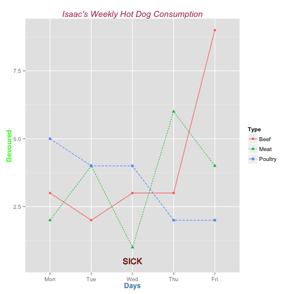


***

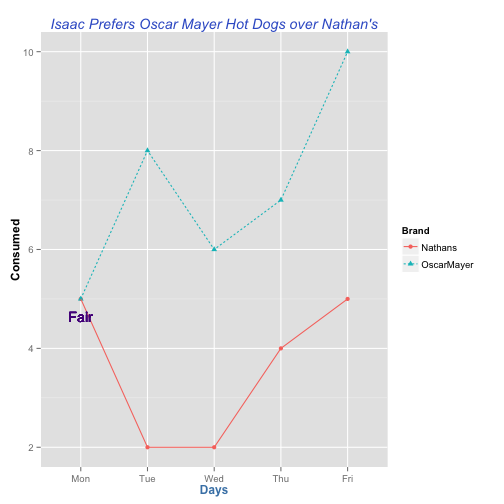


ggplot2: Teaser Code
========================================================

```r
require(ggplot2)
ggplot(hd2, aes(x = Day, y = Freq, color = Type)) +
  geom_point(aes(shape = Type)) +
  geom_line(aes(group = Type, linetype = Type)) +
  geom_text(aes(x = 3, y = 0.5, label = "SICK"), color = "tomato4") +
  ggtitle("Isaac's Weekly Hot Dog Consumption") +
  xlab("Days") +
  ylab("Devoured") +
  theme(plot.title = element_text(color = "maroon", face = "italic"),
        axis.title.x = element_text(color = "steelblue", face = "bold"),
        axis.title.y = element_text(color = "green", face = "bold"))
```


```r
ggplot(hd3, aes(x = Day, y = Freq, color = Brand)) +
  geom_point(aes(shape = Brand)) +
  geom_line(aes(group = Brand, linetype = Brand)) +
  geom_text(aes(x = 1, y = 4.65, label = "Fair"), color = "purple4") +
  ggtitle("Isaac Prefers Oscar Mayer Hot Dogs over Nathan's") +
  xlab("Days") +
  ylab("Consumed") +
  theme(plot.title = element_text(color = "royalblue3", face = "italic"),
        axis.title.x = element_text(color = "steelblue", face = "bold"),
        axis.title.y = element_text(face = "bold"))
```


ggplot2: Even Better
========================================================


```r
ggplot(hd, aes(x = Calories, y = ..density.., color = Brand)) +
  facet_grid(Type ~ Brand) +
  geom_histogram(fill = "white") +
  geom_density(size = 2)
```

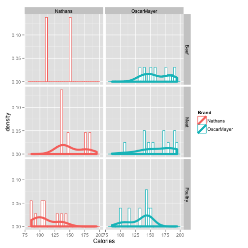


ggplot2 + reshape2
========================================================


```r
require(reshape2)
hd.melt <- melt(hd, id.vars = 1:3)
ggplot(hd.melt, aes(x = Type, y = value, fill = Brand)) +
  facet_wrap(~variable, scales = "free") +
  geom_boxplot()
```

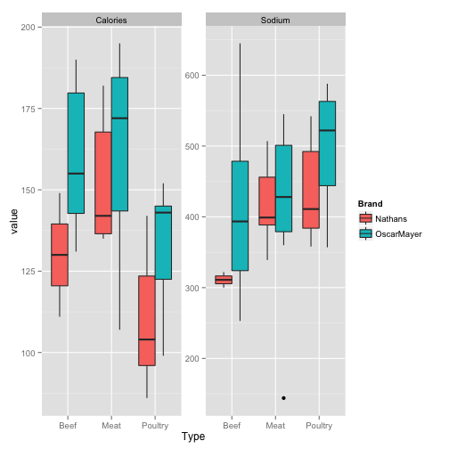


Thank you to...
========================================================
- [The R Project for Statistical Computing](http://www.r-project.org)
- [RStudio People](http://www.rstudio.com)
- [BIO5 Institute](http://www.bio5.org/)
- [Southwest Environmental Health Sciences Center](http://swehsc.pharmacy.arizona.edu/)
- [DataCamp](https://www.datacamp.com/)
- [Hadley Wickham](http://had.co.nz/)

R Session Info
========================================================

```
R version 3.0.2 (2013-09-25)
Platform: x86_64-apple-darwin10.8.0 (64-bit)

locale:
[1] en_US.UTF-8/en_US.UTF-8/en_US.UTF-8/C/en_US.UTF-8/en_US.UTF-8

attached base packages:
[1] stats     graphics  grDevices utils     datasets  methods   base     

other attached packages:
[1] reshape2_1.2.2  ggplot2_0.9.3.1 knitr_1.5      

loaded via a namespace (and not attached):
 [1] codetools_0.2-8    colorspace_1.2-4   dichromat_2.0-0   
 [4] digest_0.6.4       evaluate_0.5.1     formatR_0.10      
 [7] grid_3.0.2         gtable_0.1.2       labeling_0.2      
[10] MASS_7.3-29        munsell_0.4.2      plyr_1.8          
[13] proto_0.3-10       RColorBrewer_1.0-5 scales_0.2.3      
[16] stringr_0.6.2      tools_3.0.2       
```


