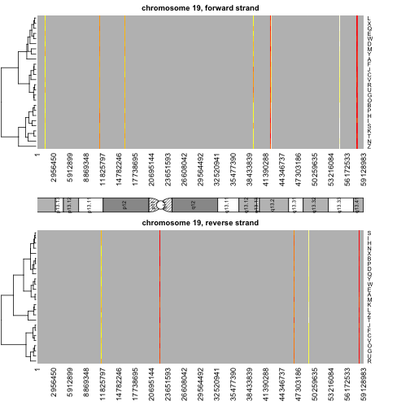

Intro to Bioconductor
========================================================
author: Isaac Jenkins
date: March 6, 2014

Material adapted from S. Falcon, M. Morgan and  R. Gentlemans' 
[*An Introduction to Bioconductor's ExpressionSet Class*](http://www.bioconductor.org/packages/release/bioc/vignettes/Biobase/inst/doc/ExpressionSetIntroduction.pdf) 
(Thank you!)


Objectives
========================================================
- Learn what Bioconductor is
- Navigate the [Bioconductor website](http://www.bioconductor.org/)
- Install Bioconductor and its packages
- Create an ***ExpressionSet*** object

About Bioconductor
========================================================
> Bioconductor is an open source, open development software project
to provide tools for the analysis and comprehension of 
high-throughput genomic data. It is based primarily on the R
programming language.

*Source*: [Bioconductor](http://www.bioconductor.org/about/)


Navigate the Bioconductor Website
========================================================
Head over to:

[](http://www.bioconductor.org/)

Installing Bioconductor
========================================================
- Bioconductor packages are run using R
- First we must install the core Bioconductor packages


```r
source("http://bioconductor.org/biocLite.R")
biocLite()
```


- This installs the Bioconductor packages BiocInstaller, Biobase,
IRanges and AnnotationDbi (as well as some dependencies)
- Refresh your package list in RStudio

Installing Bioconductor Packages
========================================================
- Functionality is similar to R packages, but installation is 
different
- **CANNOT** use the Install Packages button in RStudio
- **CANNOT** use the R function ```install.packages()```
- Instead, use the ```biocLite()``` function in the 
**BiocInstaller** package

Installing Bioconductor Packages
========================================================
- Installing Bioconductor packages requires **2 steps**
  1. Load the installer package
  2. Install the desired package
- Let's install the Bioconductor package [```affy```](http://www.bioconductor.org/packages/release/bioc/html/affy.html)


```r
require(BiocInstaller) # load the installer package
biocLite("affy") # install the affy package
```


- Note that step 1 only has to be done once during the current 
R session

Help for Bioconductor Packages
========================================================
- Similar to R, there are help files for all Bioconductor functions


```r
require(affy) # load the affy package
?expresso
```


- In general, there are exceptionally useful Vignettes


```r
browseVignettes("affy") # opens in web browser
```


A Note about Class Systems
========================================================
- R and Bioconductor packages are loaded and used similarly
- R contains an *S3* and *S4* class system
- R packages typically use the S3 system
- Bioconductor packages typically use the S4 system
- S4 is based on object-oriented programming, which is more 
formal and rigorous
- [More details on S4](http://cran.r-project.org/doc/contrib/Genolini-S4tutorialV0-5en.pdf)

Example: ExpressionSet Object
========================================================
- The **Biobase** package contains standardized data structures 
to represent genomic data
- The idea is to combine multiple sources of information into one 
convenient structure
- The *ExpressionSet* class is a common example of these 
structures
- It is the input and output of many Bioconductor functions

ExpressionSet Components
========================================================
- **assayData**: expression data from microarray experiments
- **phenoData**: metadata describing the experiment's samples
- **featureData**: metadata about the features in the experiment
- **annotation**: the platform on which the samples were assayed
- **experimentData**: a flexible structure for describing the 
experiment

What are Microarrays?
========================================================
[](http://en.wikipedia.org/wiki/DNA_microarray)

ExpressionSet from a .CEL file
========================================================
- One may have an output file from a microarray chip manufacturer
- Possible strategy is to use a bioconductor package 
(e.g., affy or limma) to read in the data as an *ExpressionSet*
or other type of object
- It is sometimes possible to convert other types of Bioconductor objects into *ExpressionSets* using the 
[```convert```](http://www.bioconductor.org/packages/release/bioc/html/convert.html) 
package

```r
biocLite("convert")
require(convert)
as(myObject, "ExpressionSet")
```

- When none of this works...

Build an ExpressionSet from Scratch
========================================================
- It's likely that your data resides in conceptually distinct parts:
  - assay data
  - phenotype meta-data
  - feature annotation
  - experiment data
- We can load these parts individually and merge them into an
*ExpressionSet* object ... sort of like Voltron.


Possible Scenario
========================================================
- You identify a Bioconductor package that is perfect for your 
analysis (e.g., 
[```ChromHeatMap```](http://www.bioconductor.org/packages/release/bioc/html/ChromHeatMap.html))
- The package takes an *ExpressionSet* object as input
- Your data is stored in an excel spreadsheet or .csv file

**What do you do?** ... Build an *ExpressionSet* object.

Gather the Data
========================================================
1. Create a new RStudio project
2. If data is in an Excel file, export to csv 
(I've already done this)
3. Put the csv files in your working directory
  - Get the files and move them your preferred way: 
  [file1](http://icj.github.io/R_Workshop/materials/day5/expression.csv) and 
  [file2](http://icj.github.io/R_Workshop/materials/day5/phenotype.csv)
  - Or, run this:
  

```r
myURL <- "http://icj.github.io/R_Workshop/materials/day5/"
download.file(paste0(myURL, "expression.csv"), "expression.csv")
download.file(paste0(myURL, "phenotype.csv"), "phenotype.csv")
```


Load Assay/Expression Data
========================================================
- Use ```read.csv()``` to load the expression data


```r
express <- read.csv("expression.csv", row.names = 1)
```


- **```row.names = 1```** tells it the first column should be read in 
as row names

- We want this to be a ```matrix```


```r
express <- as.matrix(express)
```


Check Assay/Expression Data
========================================================

```r
class(express)
```

```
[1] "matrix"
```

```r
mode(express)
```

```
[1] "numeric"
```

```r
typeof(express)
```

```
[1] "double"
```

```r
dim(express)
```

```
[1] 500  26
```


***


```r
express[1:15, 1:2]
```

```
                     A       B
AFFX-MurIL2_at  192.74  85.753
AFFX-MurIL10_at  97.14 126.196
AFFX-MurIL4_at   45.82   8.831
AFFX-MurFAS_at   22.54   3.601
AFFX-BioB-5_at   96.79  30.438
AFFX-BioB-M_at   89.07  25.846
AFFX-BioB-3_at  265.96 181.080
AFFX-BioC-5_at  110.14  57.289
AFFX-BioC-3_at   43.08  16.801
AFFX-BioDn-5_at  10.92  16.179
AFFX-BioDn-3_at 751.23 515.004
AFFX-CreX-5_at   76.94  40.907
AFFX-CreX-3_at  105.38  97.493
AFFX-BioB-5_st   40.48   7.458
AFFX-BioB-M_st   58.17  15.793
```


We could stop here...
========================================================
A minimal *ExpressionSet* object has only the expression data


```r
require(Biobase)
minimalSet <- ExpressionSet(assayData = express)
minimalSet
```

```
ExpressionSet (storageMode: lockedEnvironment)
assayData: 500 features, 26 samples 
  element names: exprs 
protocolData: none
phenoData: none
featureData: none
experimentData: use 'experimentData(object)'
Annotation:  
```


But we won't.

Load Phenotype Data
========================================================
- Use ```read.csv()``` to load the phenotype data


```r
pheno <- read.csv("phenotype.csv", 
                  colClasses = c("character", rep("factor", 2),
                                 "numeric"),
                  row.names = 1,
                  skip = 4)
```


- **```colClasses=```**: tells it what class of variable each 
column should be read in as

Check Phenotype Data
========================================================

```r
head(pheno)
```

```
  gender    type score
A Female Control  0.75
B   Male    Case  0.40
C   Male Control  0.73
D   Male    Case  0.42
E Female    Case  0.93
F   Male Control  0.22
```

```r
str(pheno)
```

```
'data.frame':	26 obs. of  3 variables:
 $ gender: Factor w/ 2 levels "Female","Male": 1 2 2 2 1 2 2 2 1 2 ...
 $ type  : Factor w/ 2 levels "Case","Control": 2 1 2 1 1 2 1 1 1 2 ...
 $ score : num  0.75 0.4 0.73 0.42 0.93 0.22 0.96 0.79 0.37 0.63 ...
```


Summarize Phenotype Data
========================================================

```r
summary(pheno)
```

```
    gender        type        score      
 Female:11   Case   :15   Min.   :0.100  
 Male  :15   Control:11   1st Qu.:0.328  
                          Median :0.415  
                          Mean   :0.537  
                          3rd Qu.:0.765  
                          Max.   :0.980  
```


Challenge
========================================================
type: prompt
1. Investigate the row and column names of the expression data.
2. Investigate the row and column names of the phenotype data.
3. What should be true about the columns of our expression data 
and the rows of our phenotype data?
4. How can you verify this in R? (hint: ```?identical```)

Challenge Solutions
========================================================
type: prompt
**The row names of the phenotype data should be identical to 
the column names of the expression data.**

```r
head(rownames(pheno))
```

```
[1] "A" "B" "C" "D" "E" "F"
```

```r
head(colnames(express))
```

```
[1] "A" "B" "C" "D" "E" "F"
```

```r
identical(rownames(pheno), colnames(express))
```

```
[1] TRUE
```


Metadata: Data about phenotype data
========================================================
- The column names of the phenotype data can often become cryptic

```
[1] "gender" "type"   "score" 
```

- Create a metadata data frame to store more meaningful descriptions

```r
meta <- data.frame(labelDescription = 
                     c("Sex of the patient at beginning of study",
                       "Case/control status", 
                       "Huffmann-Berelizka score of psychocognitive transcendance"),
                   row.names = colnames(pheno))
meta
```

```
                                                labelDescription
gender                  Sex of the patient at beginning of study
type                                         Case/control status
score  Huffmann-Berelizka score of psychocognitive transcendance
```


AnnotatedDataFrame object
========================================================
- An ```AnnotatedDataFrame``` consists of two parts:
  1. A collection of samples and the values of variables measured on those samples
  2. A description of each variable measured
- It links the phenotype data and metadata

AnnotatedDataFrame object
========================================================

```r
pheno.adf <- new("AnnotatedDataFrame",
                 data = pheno,
                 varMetadata = meta)
pheno.adf
```

```
An object of class 'AnnotatedDataFrame'
  rowNames: A B ... Z (26 total)
  varLabels: gender type score
  varMetadata: labelDescription
```


Conveniently access pheno.adf elements
========================================================

```r
# Get sample names
sampleNames(pheno.adf)
```

```
 [1] "A" "B" "C" "D" "E" "F" "G" "H" "I" "J" "K" "L" "M" "N" "O" "P" "Q"
[18] "R" "S" "T" "U" "V" "W" "X" "Y" "Z"
```

```r
# Get variable descriptions
varMetadata(pheno.adf)
```

```
                                                labelDescription
gender                  Sex of the patient at beginning of study
type                                         Case/control status
score  Huffmann-Berelizka score of psychocognitive transcendance
```

```r
# Get phenotype data
pData(pheno.adf)
```

```
  gender    type score
A Female Control  0.75
B   Male    Case  0.40
C   Male Control  0.73
D   Male    Case  0.42
E Female    Case  0.93
F   Male Control  0.22
G   Male    Case  0.96
H   Male    Case  0.79
I Female    Case  0.37
J   Male Control  0.63
K   Male    Case  0.26
L Female Control  0.36
M   Male    Case  0.41
N   Male    Case  0.80
O Female    Case  0.10
P Female Control  0.41
Q Female    Case  0.16
R   Male Control  0.72
S   Male    Case  0.17
T Female    Case  0.74
U   Male Control  0.35
V Female Control  0.77
W   Male Control  0.27
X   Male Control  0.98
Y Female    Case  0.94
Z Female    Case  0.32
```


Annotations / Feature Metadata
========================================================
- Metadata on features is as important as metadata on samples
- We can either...
  - supply our own feature metadata
  - use pre-compiled feature data packages
- Bioconductor stores feature data package by type of chip or 
instrument
- The package "hgu95av2.db" contains feature data for the 
Affymetrix hgu95av2 chip

```r
# biocLite("hgu95av2.db")
annot <- "hgu95av2.db"
```


Experiment Data
========================================================
- Basic details about the experiment
- Stored in a Microarray Experiment Information object (MIAME)

```r
experiment <- new("MIAME",
                  name = "Walter White",
                  lab = "Superlab under Lavanderia Brillante",
                  contact = "wwhite@secretlab.com",
                  title = "Breaking Bad",
                  abstract = "Running a secret meth lab...",
                  url = "www.breakingbad.com",
                  other = list(partner = "Jesse Pinkman",
                               boss = "Gustavo Fring"))
```


Experiment Data
========================================================

```r
experiment
```

```
Experiment data
  Experimenter name: Walter White 
  Laboratory: Superlab under Lavanderia Brillante 
  Contact information: wwhite@secretlab.com 
  Title: Breaking Bad 
  URL: www.breakingbad.com 
  PMIDs:  

  Abstract: A 5 word abstract is available. Use 'abstract' method.
  notes:
   partner:     
      Jesse Pinkman
   boss:     
      Gustavo Fring
```

```r
abstract(experiment)
```

```
[1] "Running a secret meth lab..."
```


See [```?MIAME```](http://svitsrv25.epfl.ch/R-doc/library/Biobase/html/class.MIAME.html) for available slots

Assemble the ExpressionSet
========================================================
We have...
  - Assay/expression data: **```express```**
  - Phenotype data and its metadata: **```pheno.adf```**
  - Annotation/feature metadata: **```annot```**
  - Experiment data: **```experiment```**
  
Assemble the ExpressionSet
========================================================
Use the **```ExpressionSet()```** function to assemble the 
*ExpressionSet*

```r
exampleSet <- ExpressionSet(assayData = express,
                            phenoData = pheno.adf,
                            annotation = annot,
                            experimentData = experiment)
exampleSet
```

```
ExpressionSet (storageMode: lockedEnvironment)
assayData: 500 features, 26 samples 
  element names: exprs 
protocolData: none
phenoData
  sampleNames: A B ... Z (26 total)
  varLabels: gender type score
  varMetadata: labelDescription
featureData: none
experimentData: use 'experimentData(object)'
Annotation: hgu95av2.db 
```


Access the ExpressionSet
========================================================
- Use ```$``` to access columns of phenotype data

```r
head(exampleSet$gender)
```

```
[1] Female Male   Male   Male   Female Male  
Levels: Female Male
```

- Use ```featureNames()``` or ```sampleNames()```

```r
head(featureNames(exampleSet))
```

```
[1] "AFFX-MurIL2_at"  "AFFX-MurIL10_at" "AFFX-MurIL4_at"  "AFFX-MurFAS_at" 
[5] "AFFX-BioB-5_at"  "AFFX-BioB-M_at" 
```

```r
head(sampleNames(exampleSet))
```

```
[1] "A" "B" "C" "D" "E" "F"
```


Access the ExpressionSet
========================================================
- Retrieve the expression/assay data using ```exprs()```

```r
exprs(exampleSet)[1:5, 1:7]
```

```
                     A       B      C      D      E     F      G
AFFX-MurIL2_at  192.74  85.753 176.76 135.57 64.494 76.36 160.50
AFFX-MurIL10_at  97.14 126.196  77.92  93.37 24.399 85.51  98.91
AFFX-MurIL4_at   45.82   8.831  33.06  28.71  5.945 28.29  30.97
AFFX-MurFAS_at   22.54   3.601  14.69  12.34 36.866 11.26  23.00
AFFX-BioB-5_at   96.79  30.438  46.13  70.93 56.174 42.68  86.52
```

- Retrieve the phenotype data frame using ```pData()```

```r
pData(exampleSet)
```

```
  gender    type score
A Female Control  0.75
B   Male    Case  0.40
C   Male Control  0.73
D   Male    Case  0.42
E Female    Case  0.93
F   Male Control  0.22
G   Male    Case  0.96
H   Male    Case  0.79
I Female    Case  0.37
J   Male Control  0.63
K   Male    Case  0.26
L Female Control  0.36
M   Male    Case  0.41
N   Male    Case  0.80
O Female    Case  0.10
P Female Control  0.41
Q Female    Case  0.16
R   Male Control  0.72
S   Male    Case  0.17
T Female    Case  0.74
U   Male Control  0.35
V Female Control  0.77
W   Male Control  0.27
X   Male Control  0.98
Y Female    Case  0.94
Z Female    Case  0.32
```


Subset the ExpressionSet
========================================================
Create a subset of the *ExpressionSet* consisting of the first 5 
features and first 3 subjects


```r
ss <- exampleSet[1:5, 1:3]
dim(ss)
```

```
Features  Samples 
       5        3 
```

```r
featureNames(ss)
```

```
[1] "AFFX-MurIL2_at"  "AFFX-MurIL10_at" "AFFX-MurIL4_at"  "AFFX-MurFAS_at" 
[5] "AFFX-BioB-5_at" 
```

```r
sampleNames(ss)
```

```
[1] "A" "B" "C"
```


Subset the ExpressionSet
========================================================
Create a subset of consisting of only male samples


```r
males <- exampleSet[, exampleSet$gender == "Male"]
males
```

```
ExpressionSet (storageMode: lockedEnvironment)
assayData: 500 features, 15 samples 
  element names: exprs 
protocolData: none
phenoData
  sampleNames: B C ... X (15 total)
  varLabels: gender type score
  varMetadata: labelDescription
featureData: none
experimentData: use 'experimentData(object)'
Annotation: hgu95av2.db 
```


Use the ExpressionSet as Input
========================================================
We'll use the ```ChromHeatMap``` package to quickly demonstrate 
how quickly our *ExpressionSet* can be utilized.

> The [```ChromHeatMap```](http://www.bioconductor.org/packages/release/bioc/html/ChromHeatMap.html) 
package provides functions for visualising
expression data in a genomic context, by generating heat map 
images in which data is plotted along a given chromosome for all
the samples in a data matrix.

Use the ExpressionSet as Input
========================================================
To use ```ChromHeatMap``` we will:

1. Use our *ExpressionSet* as input
2. Map the expression data onto chromosome coordinates
3. Plot the heatmap

Use the ExpressionSet as Input
========================================================

```r
biocLite("ChromHeatMap") # install the package
require(ChromHeatMap) # load the package

# map the expression data onto chromosome coordinates
chrdata <- makeChrStrandData(exampleSet,
                             lib = annotation(exampleSet))
plotChrMap(chrdata, chr = 19)
```




```
ChrMapPlot
Number of features plotted: 17 
```


Thank you to...
========================================================
- [The Bioconductor People](http://www.bioconductor.org/)
- Seth Falcon, Martin Morgan and Robert Gentleman: 
[Intro to *ExpressionSet*](http://www.bioconductor.org/packages/2.13/bioc/vignettes/Biobase/inst/doc/ExpressionSetIntroduction.pdf)
- Tim F. Rayner: [ChromHeatMap](http://www.bioconductor.org/packages/release/bioc/html/ChromHeatMap.html)
- [The R Project for Statistical Computing](http://www.r-project.org)
- [RStudio People](http://www.rstudio.com)
- [BIO5 Institute](http://www.bio5.org/)
- [Southwest Environmental Health Sciences Center](http://swehsc.pharmacy.arizona.edu/)

R Session Info
========================================================

```
R version 3.0.2 (2013-09-25)
Platform: x86_64-apple-darwin10.8.0 (64-bit)

locale:
[1] en_US.UTF-8/en_US.UTF-8/en_US.UTF-8/C/en_US.UTF-8/en_US.UTF-8

attached base packages:
[1] parallel  stats     graphics  grDevices utils     datasets  methods  
[8] base     

other attached packages:
 [1] ChromHeatMap_1.16.0  hgu95av2.db_2.10.1   org.Hs.eg.db_2.10.1 
 [4] RSQLite_0.11.4       DBI_0.2-7            annotate_1.40.1     
 [7] AnnotationDbi_1.24.0 Biobase_2.22.0       BiocGenerics_0.8.0  
[10] knitr_1.5           

loaded via a namespace (and not attached):
 [1] Biostrings_2.30.1    bitops_1.0-6         BSgenome_1.30.0     
 [4] codetools_0.2-8      digest_0.6.4         evaluate_0.5.1      
 [7] formatR_0.10         GenomicRanges_1.14.4 IRanges_1.20.6      
[10] RCurl_1.95-4.1       Rsamtools_1.14.3     rtracklayer_1.22.4  
[13] stats4_3.0.2         stringr_0.6.2        tools_3.0.2         
[16] XML_3.98-1           xtable_1.7-1         XVector_0.2.0       
[19] zlibbioc_1.8.0      
```


